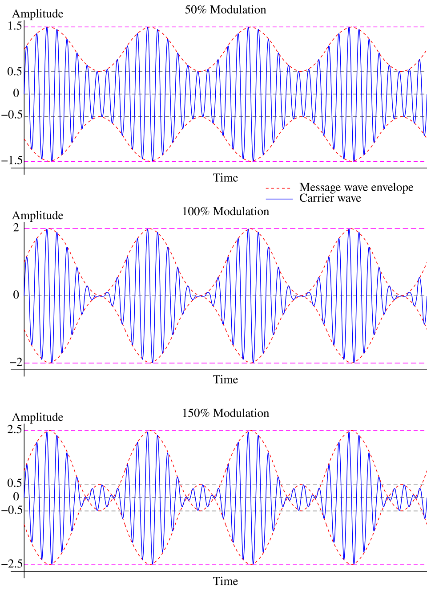
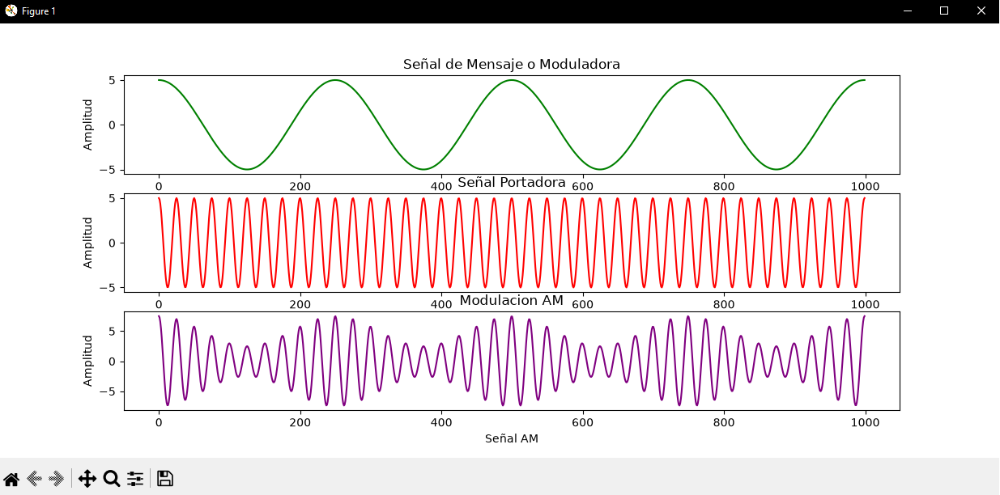
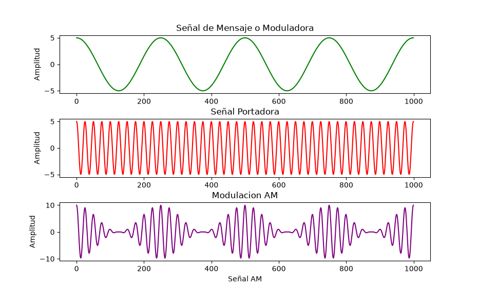
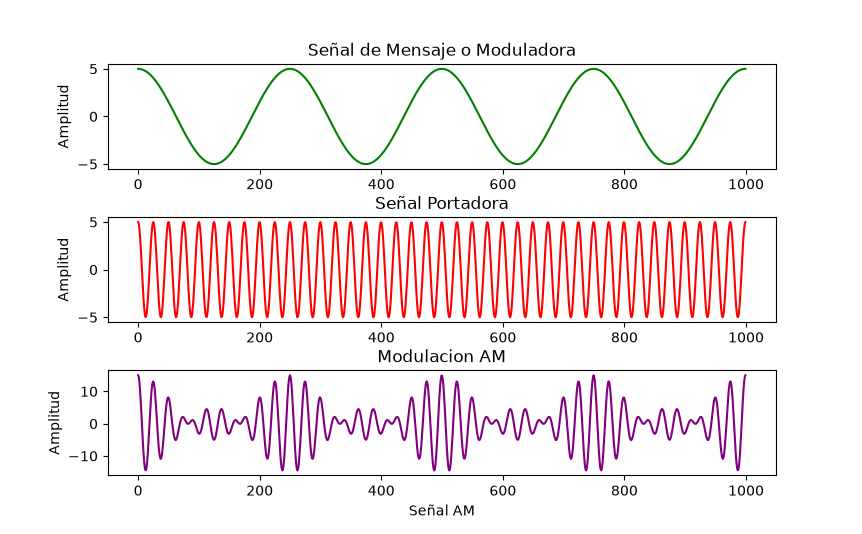
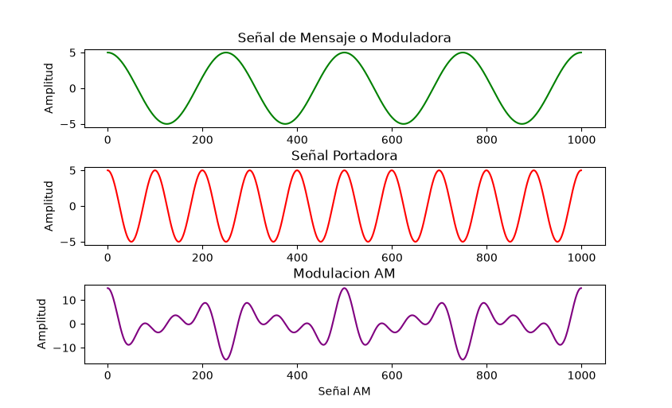
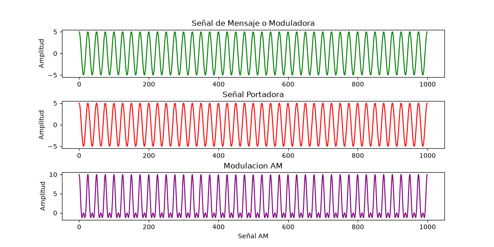

# Redes de Computadoras

## Introducción

En el presente trabajo se presentará un breve repaso del capítulo 3 del libro Stallings - Comunicaciones y Redes de Computadores 7ed. Se abordará el tema de transmisión de datos, sus principios generales y demás conceptos.

## Preguntas de repaso

### 3.1. ¿En qué se diferencia un medio guiado de un medio no guiado?

#### Transmisión

##### Medios guiados
Las ondas se transmiten confinándolas a lo largo de un camino físico, por ejemplo: pares trenzados, en cables coaxiales y en fibras ópticas.

##### Medios no guiados
Proporcionan un medio para transmitir las ondas electromagnéticas sin confinarlas, por ejemplo: propagación a través del aire, el mar o el vacío.

#### Dificultades en la transmisión - Atenuación

##### Medios guiados
En medios guiados, la reducción de la energía de la señal es exponencial, expresada por un número constante en decibelios por unidad de longitud.

##### Medios no guiados
En medios no guiados, la atenuación, es una función más compleja de la distancia y es dependiente, a su vez, de las condiciones atmosféricas.

### 3.2. ¿Cuáles son las diferencias entre una señal electromagnética analógica y una digital?

#### Señal analógica
Una señal analógica es aquella en la que la intensidad de la señal varía suavemente en el tiempo. Es decir, no presenta saltos o discontinuidades.

#### Señal digital
Una señal digital es aquella en la que la intensidad se mantiene constante durante un determinado intervalo de tiempo, tras el cual la señal cambia a otro valor constante.

### 3.3. ¿Cuáles son las tres características más importantes de una señal periódica?

Los tres características más relevantes son **la amplitud pico**, **la frecuencia** y **la fase**.
- Amplitud pico: es el valor máximo de la señal en el tiempo; normalmente, este valor se mide en voltios (V).
- Frecuencia: es la razón (en ciclos por segundo o Hercios (Hz)) a la que la señal se repite. Un parámetro equivalente es el periodo (T), definido como la cantidad de tiempo transcurrido entre dos repeticiones consecutivas de la señal; por tanto, se verifica que T = 1/ f (s).
- Fase: es una medida de la posición relativa de la señal dentro de un periodo de la misma.

### 3.4. ¿Cuántos radianes hay en 360°?

Hay 2 $\pi$ radianes.

### 3.5. ¿Cuál es la relación entre la longitud de onda y la frecuencia en una onda seno?

Primero definimos la longitud de onda ($\lambda$), es la distancia entre dos puntos de igual fase en dos ciclos consecutivos. Dada una velocidad ($v$) a la que una señal se propaga, se establece la siguiente relación entre la frecuencia y la logintud de una onda seno: $\lambda = \frac{v}{f}$

### 3.6. ¿Cuál es la relación entre el espectro de una señal y su ancho de banda?

Antes de establecer la relación, definimos ambos conceptos:
- Espectro de una señal: conjunto de frecuencias que la constituyen.
- Ancho de banda: también denominado ancho de banda efectivo, es la banda en la que se concentra la mayor parte de
la energía de la señal.

El ancho de banda surge de la diferencia entre la frecuencia más alta y la más baja del espectro de una señal. 

### 3.7. ¿Qué es la atenuación?

Dada una señal, se define atenuación a la pérdida de energía de la señal en función de la distancia recorrida.

### 3.8. Defina la capacidad de un canal.

Capacidad de un canal: la velocidad máxima a la que se pueden transmitir los datos en un canal, o ruta de comunicación de datos, bajo unas condiciones dadas.

### 3.9. ¿Qué factores clave afectan a la capacidad de un canal?

1) La velocidad de transmisión de los datos: velocidad, expresada en bits por segundo (bps), a la que se pueden transmitir los datos.
2) El ancho de banda: ancho de banda de la señal transmitida; éste estará limitado por el transmisor y por la naturaleza del medio de transmisión; se mide en ciclos por segundo o hercios.
3) El ruido: nivel medio de ruido a través del camino de transmisión.
4) La tasa de errores: tasa a la que ocurren los errores. Se considera que ha habido un error cuando se recibe un 1 habiendo transmitido un 0, o se recibe un 0 habiendo transmitido un 1.

## Ejercicios

### 3.1.
a) En una configuración multipunto, sólo un dispositivo puede trasmitir cada vez, ¿por qué?

b) Hay dos posibles aproximaciones que refuerzan la idea de que, en un momento dado, sólo un dispositivo puede transmitir. En un sistema centralizado, una estación es la responsable del control y podrá transmitir o decidir que lo haga cualquier otra. En el método descentralizado, las estaciones cooperan entre sí, estableciéndose una serie de turnos. ¿Qué ventajas y desventajas presentan ambas aproximaciones?

**Resolución.**

a) Porque el medio de transmisión es compartido por todos los dispositivos. Si dos o más transmitieran a la vez, sus señales se superpondrían en el medio produciendo interferencia (una colisión), y la señal resultante sería ininteligible en el receptor. Por eso el acceso al medio debe regularse para que haya una única señal en tránsito en cada instante.

b) Comparación de ambas aproximaciones:

- **Centralizado.** *Ventajas:* la lógica de acceso en cada estación es más simple; el control (arbitraje, prioridades, calidad de servicio) se concentra en un único punto; no hay que resolver contiendas entre estaciones iguales. *Desventajas:* la estación de control es un punto único de fallo (si falla, cae toda la red) y puede convertirse en un cuello de botella que limite las prestaciones.
- **Descentralizado.** *Ventajas:* no hay punto único de fallo, con lo que la red es más robusta y fiable. *Desventajas:* la lógica de control es más compleja y está distribuida en cada estación, lo que dificulta la coordinación.

### 3.2.
Una señal tiene una frecuencia fundamental de 1000 Hz. ¿Cuál es su periodo?

**Resolución.**

El periodo es el inverso de la frecuencia:

$$T = \frac{1}{f} = \frac{1}{1000\ \text{Hz}} = 10^{-3}\ \text{s} = 1\ \text{ms}$$

### 3.3.
Simplifique las siguientes expresiones:

a) $\sin(2\pi f t - \pi) + \sin(2\pi f t + \pi)$

b) $\sin(2\pi f t) + \sin(2\pi f t - \pi)$

**Resolución.**

Usamos las identidades $\sin(x - \pi) = -\sin(x)$ y $\sin(x + \pi) = -\sin(x)$, con $x = 2\pi f t$:

a) $\sin(2\pi f t - \pi) + \sin(2\pi f t + \pi) = -\sin(2\pi f t) - \sin(2\pi f t) = -2\sin(2\pi f t)$

b) $\sin(2\pi f t) + \sin(2\pi f t - \pi) = \sin(2\pi f t) - \sin(2\pi f t) = 0$

### 3.4.
El sonido se puede modelar mediante funciones sinusoidales. Compare la frecuencia relativa y la longitud de onda de las notas musicales. Piense que la velocidad del sonido es igual a 330 m/s y que las frecuencias de una escala musical son:

| Nota | DO | RE | MI | FA | SOL | LA | SI | DO |
|------|----|----|----|----|-----|----|----|----|
| Frecuencia | 264 | 297 | 330 | 352 | 396 | 440 | 495 | 528 |

**Resolución.**

La longitud de onda se obtiene como $\lambda = v / f$, con $v = 330$ m/s. Aplicándolo a cada nota:

| Nota | DO | RE | MI | FA | SOL | LA | SI | DO |
|------|----|----|----|----|-----|----|----|----|
| Frecuencia (Hz) | 264 | 297 | 330 | 352 | 396 | 440 | 495 | 528 |
| $\lambda$ (m) | 1,250 | 1,111 | 1,000 | 0,938 | 0,833 | 0,750 | 0,667 | 0,625 |

La relación entre frecuencia y longitud de onda es **inversamente proporcional**: a mayor frecuencia, menor longitud de onda. En una octava (de DO a DO, donde la frecuencia se duplica de 264 Hz a 528 Hz) la longitud de onda se reduce a la mitad (de 1,250 m a 0,625 m).

### 3.5.
Si la curva trazada con una línea continua de la Figura 3.17 representa al $\sin(2\pi t)$, ¿qué función corresponde a la línea discontinua? En otras palabras, la línea discontinua se puede expresar como $A \sin(2\pi f t + \theta)$; ¿qué son $A$, $f$ y $\theta$?

**Resolución.**

Tomando como referencia la línea continua, $\sin(2\pi t)$, que tiene amplitud $1$ y frecuencia $f = 1$ (periodo $1$), comparamos la línea discontinua:

- **Amplitud:** la discontinua oscila entre $+2$ y $-2$, por lo que $A = 2$.
- **Frecuencia:** completa un ciclo cada $0{,}5$ unidades de tiempo (el doble de rápido que la continua), luego $f = 2$.
- **Fase:** ambas curvas cruzan el cero en $t = 0$ subiendo, por lo que están en fase: $\theta = 0$.

Por lo tanto, la línea discontinua corresponde a:

$$A \sin(2\pi f t + \theta) = 2 \sin(2\pi \cdot 2 \cdot t) = 2 \sin(4\pi t)$$

es decir, tiene el doble de amplitud y el doble de frecuencia que la señal continua, y en fase con ella.

### 3.6.
Exprese la señal $(1 + 0{,}1 \cos 5t) \cos 100t$ como combinación lineal de funciones sinusoidales; encuentre la amplitud, frecuencia y fase de cada una de las componentes. (Sugerencia: use la expresión del $\cos a \cos b$).

**Resolución.**

Desarrollamos el producto:

$$(1 + 0{,}1 \cos 5t)\cos 100t = \cos 100t + 0{,}1 \cos 5t \cos 100t$$

Aplicando la identidad $\cos a \cos b = \tfrac{1}{2}\left[\cos(a - b) + \cos(a + b)\right]$ al segundo término:

$$0{,}1 \cos 5t \cos 100t = 0{,}05\left[\cos 95t + \cos 105t\right]$$

Por lo tanto, la señal como combinación lineal de sinusoides es:

$$\cos 100t + 0{,}05 \cos 95t + 0{,}05 \cos 105t$$

Las tres componentes (todas con fase nula al expresarse como cosenos) son:

| Componente | Amplitud | Frecuencia angular | Frecuencia | Fase |
|------------|----------|--------------------|------------|------|
| $\cos 100t$ | $1$ | $100$ rad/s | $100/2\pi \approx 15{,}92$ Hz | $0$ |
| $0{,}05\cos 95t$ | $0{,}05$ | $95$ rad/s | $95/2\pi \approx 15{,}12$ Hz | $0$ |
| $0{,}05\cos 105t$ | $0{,}05$ | $105$ rad/s | $105/2\pi \approx 16{,}71$ Hz | $0$ |

### 3.7.
Encuentre el periodo de la función $f(t) = (10 \cos t)^2$.

**Resolución.**

Aplicamos la identidad $\cos^2 x = \tfrac{1}{2}(1 + \cos 2x)$:

$$f(t) = 100 \cos^2 t = 100 \cdot \frac{1 + \cos 2t}{2} = 50 + 50 \cos 2t$$

El único término variable es $\cos 2t$, cuyo periodo es $\dfrac{2\pi}{2} = \pi$. Por lo tanto, el periodo de $f(t)$ es:

$$T = \pi\ \text{s} \approx 3{,}14\ \text{s}$$

### 3.8.
Sean dos funciones periódicas $f_1(t)$ y $f_2(t)$, con periodos $T_1$ y $T_2$ respectivamente. ¿Es periódica la función $f(t) = f_1(t) + f_2(t)$? Si es así, demuéstrelo. Si no, ¿bajo qué condiciones $f(t)$ será periódica?

**Resolución.**

La suma **no es necesariamente periódica**: lo será si y sólo si los periodos $T_1$ y $T_2$ son **conmensurables**, es decir, si su cociente es un número racional:

$$\frac{T_1}{T_2} = \frac{m}{n}, \quad \text{con } m, n \in \mathbb{Z}^{+}$$

En ese caso existe un periodo común $T = n\,T_1 = m\,T_2$ (con $m/n$ irreducible, $T$ es el mínimo común múltiplo de $T_1$ y $T_2$), y se verifica:

$$f(t + T) = f_1(t + n T_1) + f_2(t + m T_2) = f_1(t) + f_2(t) = f(t)$$

lo que prueba que $f(t)$ es periódica de periodo $T$. Si, en cambio, $T_1/T_2$ es irracional, no existe ningún $T$ que sea múltiplo entero de ambos periodos y $f(t)$ **no es periódica**.

### 3.9.
La Figura 3.4 muestra el efecto resultante al eliminar las componentes de alta frecuencia de un pulso cuadrado, considerando sólo las componentes de baja frecuencia. ¿Cómo sería la señal resultante en el caso contrario (es decir, quedándose con todos los armónicos de frecuencia alta y eliminando los de bajas frecuencias)?

**Resolución.**

Las componentes de **baja frecuencia** aportan la forma global del pulso: su nivel medio y las porciones planas (constantes) de la onda cuadrada. Las componentes de **alta frecuencia**, en cambio, son las responsables de las transiciones abruptas, es decir, de los flancos (bordes) del pulso.

Por lo tanto, al hacer lo contrario —quedarse sólo con las altas frecuencias (filtrado paso alto) y eliminar las bajas— se pierde el "cuerpo" del pulso (las zonas planas y el nivel de continua quedan en cero) y la señal resultante presenta únicamente **picos u oscilaciones bruscas localizadas en los flancos**, allí donde la onda original cambia de valor. En otras palabras, se resaltan las transiciones y desaparecen los tramos de nivel constante.

### 3.10.
La Figura 3.5b muestra la función correspondiente a un pulso rectangular en el dominio de la frecuencia. Este pulso puede corresponder a un 1 digital en un sistema de comunicación. Obsérvese que se necesita un número infinito de frecuencias (con amplitud decreciente cuanto mayor es la frecuencia). ¿Qué implicaciones tiene este hecho en un sistema de transmisión real?

**Resolución.**

Un pulso rectangular ideal tendría un espectro infinito, pero todo sistema de transmisión real (transmisor + medio + receptor) sólo puede transmitir una **banda limitada de frecuencias**. Esto tiene varias implicaciones:

- Las componentes de alta frecuencia se atenúan o se eliminan, de modo que el pulso recibido aparece **distorsionado**: sus flancos se redondean y el pulso se ensancha en el tiempo. Un pulso perfectamente rectangular es, por tanto, físicamente imposible de transmitir.
- Ese ensanchamiento temporal puede provocar **interferencia entre símbolos** y, en consecuencia, **limita la velocidad de transmisión** alcanzable en el medio.
- Como la mayor parte de la energía se concentra en las frecuencias bajas (la amplitud decrece al aumentar la frecuencia), un ancho de banda finito suele ofrecer una aproximación aceptable del pulso. Existe así un **compromiso** entre el ancho de banda disponible (coste) y la fidelidad o velocidad de transmisión: a mayor ancho de banda, mejor se aproxima la señal recibida al pulso ideal.

### 3.11.
El IRA es un código de 7 bits que permite la definición de 128 caracteres. En los años setenta, muchos medios de comunicación recibían las noticias a través de un servicio que usaba 6 bits denominado TTS. Este código transmitía caracteres en mayúsculas y minúsculas, así como caracteres especiales y órdenes de control. Generalmente, se utilizan 100 caracteres. ¿Cómo cree que se puede conseguir esto?

**Resolución.**

Con 6 bits sólo se dispone de $2^6 = 64$ combinaciones, insuficientes para los ~100 caracteres necesarios. La solución es usar **caracteres de cambio (shift)**, como en el código Baudot: se reservan dos combinaciones como códigos de conmutación que hacen que las siguientes combinaciones se interpreten según un conjunto de caracteres u otro (por ejemplo, uno para "letras" y otro para "figuras/mayúsculas").

De este modo, cada uno de los códigos restantes representa **dos** símbolos distintos según el modo activo, duplicando la capacidad efectiva a casi $2 \times 62 = 124$ caracteres, más que suficiente para los 100 requeridos. El coste es que hay que transmitir un carácter de cambio cada vez que se pasa de un conjunto al otro.

### 3.12.
¿Cuál es el incremento posible en la resolución horizontal para una señal de vídeo de ancho de banda 5 MHz? ¿Y para la resolución vertical? Responda ambas cuestiones por separado; es decir, utilice el incremento de ancho de banda para aumentar la resolución horizontal o la vertical, pero no ambas.

**Resolución.**

Partimos del análisis del texto (Sección 3.2): una señal de vídeo estándar con 450 elementos horizontales y 483 líneas verticales genera una frecuencia máxima (ancho de banda) de $\approx 4{,}286$ MHz, que surge de $225$ ciclos cada $52{,}5\ \mu\text{s}$ de línea activa. El ancho de banda es **proporcional a la resolución** en cada dimensión, ya que:

- al aumentar los elementos horizontales por línea, aumentan los ciclos en el mismo tiempo de línea;
- al aumentar el número de líneas (a 30 barridos/s fijos), se reduce el tiempo por línea en la misma proporción.

El nuevo ancho de banda de 5 MHz supone un factor $5 / 4{,}286 = 1{,}167$ respecto del estándar, de modo que la resolución puede incrementarse un **~16,7 %** en una de las dimensiones (no en ambas a la vez):

- **Resolución horizontal:** de $450$ a $450 \times 1{,}167 \approx 525$ elementos por línea (incremento de ~75 elementos).
- **Resolución vertical:** de $483$ a $483 \times 1{,}167 \approx 563$ líneas (incremento de ~80 líneas).

### 3.13.
a) Suponga que se transmite una imagen digitalizada de TV de $480 \times 500$ puntos, en la que cada punto puede tomar uno de entre 32 posibles valores de intensidad. Supóngase que se envían 30 imágenes por segundo (esta fuente digital es aproximadamente igual que los estándares adoptados para la difusión de TV). Determine la velocidad de transmisión $R$ de la fuente en bps.

b) Suponga que la fuente anterior se transmite por un canal de 4,5 MHz de ancho de banda con una relación señal-ruido de 35 dB. Encuentre la capacidad del canal en bps.

c) ¿Cómo se deberían modificar los parámetros del apartado (a) para permitir la transmisión de la señal de TV en color sin incrementar el valor de $R$?

**Resolución.**

a) Cada punto puede tomar uno de $32 = 2^5$ valores, por lo que se necesitan $5$ bits por punto. La velocidad de transmisión es:

$$R = (480 \times 500\ \text{puntos}) \times 5\ \tfrac{\text{bits}}{\text{punto}} \times 30\ \tfrac{\text{imágenes}}{\text{s}} = 36 \times 10^{6}\ \text{bps} = 36\ \text{Mbps}$$

b) Con una relación señal-ruido de 35 dB, el valor lineal es $\text{SNR} = 10^{35/10} = 10^{3{,}5} \approx 3162$. Aplicando la fórmula de Shannon:

$$C = B \log_2(1 + \text{SNR}) = 4{,}5 \times 10^{6} \cdot \log_2(3163) \approx 4{,}5 \times 10^{6} \times 11{,}63 \approx 52{,}3\ \text{Mbps}$$

Como $C \approx 52{,}3\ \text{Mbps} > R = 36\ \text{Mbps}$, el canal tiene capacidad suficiente para transmitir la fuente.

c) La señal de color requiere aproximadamente el triple de información (tres componentes de color). Para mantener $R$ constante hay que reducir en la misma proporción alguno de los otros parámetros: disminuir el número de niveles de intensidad por punto (menos bits/punto), reducir la resolución espacial (menos puntos por imagen) o bajar la cantidad de imágenes por segundo, de forma que el producto total de bits por segundo no aumente.

### 3.14.
Dado un amplificador con una temperatura efectiva de ruido de 10.000 °K y con un ancho de banda de 10 MHz, ¿cuánto será el nivel de ruido térmico a la salida?

**Resolución.**

El nivel de ruido térmico es $N = kTB$, con $k = 1{,}38 \times 10^{-23}$ J/K, $T = 10\,000$ K y $B = 10\ \text{MHz} = 10^{7}$ Hz:

$$N = 1{,}38 \times 10^{-23} \times 10^{4} \times 10^{7} = 1{,}38 \times 10^{-12}\ \text{W}$$

Expresado en decibelios-vatio, según la fórmula del texto $N = -228{,}6\ \text{dBW} + 10\log T + 10\log B$:

$$N = -228{,}6 + 10\log(10^{4}) + 10\log(10^{7}) = -228{,}6 + 40 + 70 = -118{,}6\ \text{dBW}$$

### 3.15.
¿Cuál es la capacidad para un canal de un «teletipo» de 300 Hz de ancho de banda con una relación señal-ruido de 3 dB?

**Resolución.**

Convertimos la relación señal-ruido a valor lineal: $\text{SNR} = 10^{3/10} = 10^{0{,}3} \approx 2$. Aplicando la fórmula de Shannon con $B = 300$ Hz:

$$C = B \log_2(1 + \text{SNR}) = 300 \cdot \log_2(1 + 2) = 300 \cdot \log_2 3 \approx 300 \times 1{,}585 \approx 475\ \text{bps}$$

### 3.16.
Para operar a 9.600 bps se usa un sistema de señalización digital:

a) Si cada elemento de señal codifica una palabra de 4 bits, ¿cuál es el ancho de banda mínimo necesario?

b) ¿Y para palabras de 8 bits?

**Resolución.**

Usamos la fórmula de Nyquist $C = 2B \log_2 M$, donde $M$ es el número de niveles de señalización. Despejando el ancho de banda: $B = \dfrac{C}{2 \log_2 M}$, con $C = 9600$ bps.

a) Con palabras de 4 bits hay $M = 2^{4} = 16$ niveles, luego $\log_2 M = 4$:

$$B = \frac{9600}{2 \times 4} = 1200\ \text{Hz}$$

b) Con palabras de 8 bits hay $M = 2^{8} = 256$ niveles, luego $\log_2 M = 8$:

$$B = \frac{9600}{2 \times 8} = 600\ \text{Hz}$$

### 3.17.
¿Cuál es el nivel de ruido térmico para un canal de ancho de banda de 10 kHz y 1000 W de potencia operando a 50 °C?

**Resolución.**

El ruido térmico $N = kTB$ **no depende de la potencia de la señal** (el dato de 1000 W es irrelevante para este cálculo). Convertimos la temperatura a kelvin: $T = 50\ °\text{C} + 273 = 323$ K, con $B = 10\ \text{kHz} = 10^{4}$ Hz:

$$N = kTB = 1{,}38 \times 10^{-23} \times 323 \times 10^{4} \approx 4{,}46 \times 10^{-17}\ \text{W}$$

En decibelios-vatio:

$$N = -228{,}6 + 10\log(323) + 10\log(10^{4}) = -228{,}6 + 25{,}1 + 40 = -163{,}5\ \text{dBW}$$

### 3.18.
Considérense los trabajos de Shannon y Nyquist sobre la capacidad del canal. Cada uno de ellos estableció un límite superior para la razón de bits del canal basándose en dos aproximaciones diferentes. ¿Cómo se pueden relacionar ambas aproximaciones?

**Resolución.**

Las dos formulaciones describen aspectos complementarios:

- **Nyquist** ($C = 2B \log_2 M$) da la máxima velocidad en un canal **sin ruido**, y depende del ancho de banda $B$ y del número de niveles de señalización $M$ que se decidan usar.
- **Shannon** ($C = B \log_2(1 + \text{SNR})$) da la máxima velocidad teórica en un canal **con ruido**, en función del ancho de banda y de la relación señal-ruido.

Se relacionan igualando ambas expresiones para averiguar cuántos niveles $M$ soporta una determinada SNR:

$$2B \log_2 M = B \log_2(1 + \text{SNR}) \;\Rightarrow\; M^{2} = 1 + \text{SNR} \;\Rightarrow\; M = \sqrt{1 + \text{SNR}}$$

Es decir, Shannon fija el límite máximo de velocidad que impone el ruido, y Nyquist indica el número de niveles necesarios para alcanzarlo; el número máximo de niveles útiles es $M = \sqrt{1 + \text{SNR}}$.

### 3.19.
Sea un canal con una capacidad de 20 Mbps. El ancho de banda de dicho canal es 3 MHz. ¿Cuál es la relación señal-ruido admisible para conseguir la mencionada capacidad?

**Resolución.**

Partimos de la fórmula de Shannon $C = B \log_2(1 + \text{SNR})$ y despejamos la relación señal-ruido:

$$\log_2(1 + \text{SNR}) = \frac{C}{B} = \frac{20 \times 10^{6}}{3 \times 10^{6}} = 6{,}67$$

$$1 + \text{SNR} = 2^{6{,}67} \approx 101{,}6 \;\Rightarrow\; \text{SNR} \approx 100{,}6$$

En decibelios: $\text{SNR}_{\text{dB}} = 10 \log_{10}(100{,}6) \approx 20\ \text{dB}$.

### 3.20.
La onda cuadrada de la Figura 3.7c, con $T = 1$ ms, se transmite a través de un filtro paso bajo ideal de ganancia unidad con frecuencia de corte a 8 kHz.

a) Determine la potencia de la señal de salida.

b) Suponiendo que a la entrada del filtro hay un ruido térmico con $N_0 = 0{,}1\ \mu\text{W/Hz}$, encuentre la relación señal-ruido en dB a la salida.

**Resolución.**

La onda cuadrada de la Figura 3.7c tiene amplitud $\pm 1$ y frecuencia fundamental $f = 1/T = 1/(1\ \text{ms}) = 1000\ \text{Hz} = 1\ \text{kHz}$. Su serie de Fourier sólo contiene armónicos impares, con amplitud de pico $\dfrac{4}{\pi}\cdot\dfrac{1}{k}$ en la frecuencia $k f$:

$$s(t) = \frac{4}{\pi}\left[\sin(2\pi f t) + \frac{1}{3}\sin(2\pi 3f t) + \frac{1}{5}\sin(2\pi 5f t) + \frac{1}{7}\sin(2\pi 7f t) + \cdots\right]$$

El filtro paso bajo ideal con frecuencia de corte a 8 kHz deja pasar los armónicos de 1, 3, 5 y 7 kHz, y elimina el de 9 kHz y superiores.

a) La potencia media de cada sinusoide de amplitud de pico $A_p$ es $A_p^2/2$ (sobre $1\ \Omega$). Sumando la de los cuatro armónicos que pasan:

$$P = \sum_{k=1,3,5,7} \frac{1}{2}\left(\frac{4}{k\pi}\right)^2 = \frac{8}{\pi^2}\left(1 + \frac{1}{9} + \frac{1}{25} + \frac{1}{49}\right) = \frac{8}{\pi^2}(1{,}1715) \approx 0{,}95\ \text{W}$$

(La onda cuadrada completa tendría potencia $1$ W; estos cuatro armónicos concentran ~95 % de ella.)

b) El ruido térmico a la salida ocupa el ancho de banda del filtro, $B = 8\ \text{kHz}$, con densidad $N_0 = 0{,}1\ \mu\text{W/Hz} = 10^{-7}\ \text{W/Hz}$:

$$N = N_0 \cdot B = 10^{-7} \times 8 \times 10^{3} = 8 \times 10^{-4}\ \text{W}$$

La relación señal-ruido resulta:

$$\text{SNR} = \frac{P}{N} = \frac{0{,}95}{8 \times 10^{-4}} \approx 1187 \;\Rightarrow\; \text{SNR}_{\text{dB}} = 10\log_{10}(1187) \approx 30{,}7\ \text{dB}$$

## Inciso 4 — Modulación de Amplitud (AM)

La Modulación de Amplitud (AM) es una de las técnicas pioneras en las telecomunicaciones, desarrollada durante el primer cuarto del siglo 20 para la transmisión de información mediante ondas de radio. Este proceso consiste en variar la amplitud de una señal portadora de alta frecuencia de forma proporcional a los cambios de una señal moduladora o mensaje, como puede ser una señal de audio, permitiendo transportar la información a través del medio de transmisión.

Ecuación general:

$$AM(t) = A_{p}\left[1 + k_{a} \cdot \cos(2\pi \cdot f_m \cdot t)\right]\cos(2\pi \cdot f_{p} \cdot t)$$

Donde $A_{p}$ es la amplitud de la señal portadora, $f_{p}$ la frecuencia de la portadora, $AM(t)$ la señal modulada en el tiempo, $f_m$ la frecuencia de la moduladora y $k_{a}$ el índice de modulación.

Este $k_{a}$ o también $h$, indica la variación introducida por la modulación respecto al nivel de la señal original.

$$h = \frac{\text{valor máximo de } m(t)}{A} = \frac{M}{A}$$

donde $M$ y $A$ son la amplitud del mensaje y la amplitud de la portadora. Para evitar la distorsión, se usan circuitos limitadores para evitar una variación por encima del 100 % o de $h = 1$.

{width="2.917361111111111in" height="3.1284722222222223in"}

### Implementación en Python

Se usan las librerías "NumPy" y "matplotlib": la primera permite crear vectores y matrices grandes multidimensionales, junto con una gran colección de funciones matemáticas de alto nivel para operar con ellas, mientras que la segunda es la encargada de la generación de los gráficos en 2 dimensiones que nos permiten visualizar los distintos casos presentados a continuación.

Usando el código implementado por la página web que se nos proporcionó en la consigna.

### Casos de prueba

#### Caso 1
Se utiliza un $h = 0{,}5$ dando el 50 % de modulación.

{width="6.120138888888889in" height="3.032638888888889in"}

#### Caso 2
Se utiliza un $h = 1$ con una modulación del 100 %.

{width="5.429861111111111in" height="3.3361111111111112in"}

#### Caso 3
Se utiliza un $h = 2$ con una modulación del 200 %.

{width="5.824305555555555in" height="3.607638888888889in"}

#### Caso 4
Se bajó la frecuencia de la señal portadora desde 40 kHz a 10 kHz.

{width="5.395138888888889in" height="3.279166666666667in"}

#### Caso 5
Se subió la frecuencia de la señal moduladora desde 4 kHz a 40 kHz.

{width="5.366666666666666in" height="2.683333333333333in"}

### Conclusión

A través de las distintas pruebas realizadas, se pudo comprobar la importancia de mantener un índice $k_{a}$ en un rango adecuado para evitar una sobremodulación y producir una distorsión en la señal de la modulación. Por otro lado, se comprobó la necesidad de conservar una relación de frecuencias adecuadas para que el proceso de modulación se produzca de manera correcta.
