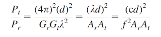
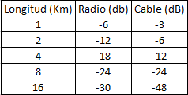

# Redes de Computadoras

**Integrantes:**
* Arias, Daniel Andrés
* Garzón, Pablo
* Gutierrez, Patricio
* Fernández y Fernández, Sergio Ezequiel
* Loza Denardi, Gabriel Jeremías
* Rocatagliatta, Leandro Agustin
* Zambellini, Matías Manuel

## Introducción
En el presente trabajo se realizará un breve repaso del capítulo 4 del libro *Stallings - Comunicaciones y Redes de Computadores, 7.ª edición*. Se abordarán los medios de transmisión, la propagación de ondas electromagnéticas y la relación entre frecuencia, longitud de onda, distancia y tamaño de las antenas.

---

### Ejercicio 4.1

**Datos disponibles:**
* Capacidad por disquete: $1{,}4\text{ Mbytes}$
* Peso total de la carga: $10.000\text{ kg}$
* Peso de cada disquete: $30\text{ g} = 0{,}03\text{ kg}$
* Velocidad de transporte ($v$): $1.000\text{ km/h}$
* Distancia ($d$): $5.000\text{ km}$

**Resolución:**
Cantidad de disquetes:
$$\frac{10.000\text{ kg}}{0{,}03\text{ kg/disquete}} \approx 333.333{,}33\text{ disquetes}$$

Bits por disquete:
$$1{,}4 \times 10^6\text{ bytes} \times 8\text{ bits/byte} = 11{,}2 \times 10^6\text{ bits}$$

Bits en total:
$$333.333{,}33 \times 11{,}2 \times 10^6\text{ bits} \approx 3{,}73 \times 10^{12}\text{ bits}$$

Tiempo de viaje ($t$):
$$t = \frac{d}{v} = \frac{5.000\text{ km}}{1.000\text{ km/h}} = 5\text{ horas} = 18.000\text{ segundos}$$

Velocidad de transmisión equivalente:
$$\text{Velocidad} = \frac{3{,}73 \times 10^{12}\text{ bits}}{18.000\text{ s}} \approx 2{,}07 \times 10^8\text{ bits/s} \approx 207\text{ Mbps}$$

---

### Ejercicio 4.2

**Datos:**
* Atenuación de la línea: $20\text{ dB}$
* $P_{\text{entrada}} = 0{,}5\text{ W}$
* $P_{\text{ruido}} = 4{,}5\text{ W}$

**Resolución:**
Calculamos primero la potencia de salida ($P_{\text{salida}}$) aplicando la pérdida:
$$P_{\text{salida}} = P_{\text{entrada}} \times 10^{-L/10} = 0{,}5 \times 10^{-20/10} = 0{,}5 \times 10^{-2} = 0{,}005\text{ W}$$

Relación Señal a Ruido (SNR) lineal:
$$\text{SNR} = \frac{P_{\text{salida}}}{P_{\text{ruido}}} = \frac{0{,}005}{4{,}5} \approx 0{,}001111$$

Pasamos a decibelios ($\text{dB}$):
$$\text{SNR}_{\text{dB}} = 10 \log_{10}(0{,}001111) \approx -29{,}54\text{ dB}$$

*Conclusión:* El resultado negativo indica que la potencia del ruido supera ampliamente a la potencia de la señal útil en la salida, por lo que la señal queda prácticamente tapada por el ruido.

---

### Ejercicio 4.3

**Datos iniciales:**
* $P_{\text{Transmisión}} = 100\text{ W}$
* $P_{\text{Recepción}} = 1\text{ W}$

| Medio | Rango de Frecuencias | Atenuación típica ($\alpha$) |
| :--- | :---: | :---: |
| Par trenzado (con carga) | $0 \text{ a } 3{,}5\text{ kHz}$ | $0{,}2\text{ dB/km}$ |
| Par trenzado (multi-pares) | $0 \text{ a } 1\text{ MHz}$ | $3\text{ dB/km}$ |
| Cable coaxial | $0 \text{ a } 500\text{ MHz}$ | $7\text{ dB/km}$ |
| Fibra óptica | $180 \text{ a } 370\text{ THz}$ | $0{,}2 \text{ a } 0{,}5\text{ dB/km}$ |

Pérdida máxima admisible: 
$$10 \log_{10}\left(\frac{P_{\text{Transmisión}}}{P_{\text{Recepción}}}\right) = 10 \log_{10}\left(\frac{100}{1}\right) = 20\text{ dB}$$

Longitud máxima ($L$): $L = \frac{20\text{ dB}}{\alpha}$

* **a) Par trenzado con carga ($0{,}2\text{ dB/km}$):** 
  $$L = \frac{20}{0{,}2} = 100\text{ km}$$
* **b) Par trenzado multi-pares ($3\text{ dB/km}$):** 
  $$L = \frac{20}{3} \approx 6{,}67\text{ km}$$
* **c) Cable coaxial ($7\text{ dB/km}$):** 
  $$L = \frac{20}{7} \approx 2{,}86\text{ km}$$
* **d) Cable coaxial ($7\text{ dB/km}$):** 
  $$L = \frac{20}{7} \approx 2{,}86\text{ km}$$
* **e) Fibra óptica (tomando el valor menor de $0{,}2\text{ dB/km}$):** 
  $$L = \frac{20}{0{,}2} = 100\text{ km}$$

---

### Ejercicio 4.4

La malla exterior del cable coaxial, al estar conectada a tierra, actúa como un blindaje efectivo que reduce las interferencias electromagnéticas externas (EMI) y la diafonía entre cables cercanos, mejorando notablemente la integridad de la señal transmitida.

---

### Ejercicio 4.5

La pérdida de propagación en el espacio libre se calcula mediante:
$$L = 10 \log_{10}\left(\frac{4 \pi d}{\lambda}\right)^2$$

Sabiendo que $\lambda = \frac{c}{f}$, reemplazamos en la fórmula:
$$L = 10 \log_{10}\left(\frac{4 \pi d f}{c}\right)^2$$

Si se duplica la frecuencia ($f_2 = 2 f_1$), la diferencia de pérdidas es:
$$L_2 - L_1 = 20 \log_{10}\left(\frac{f_2}{f_1}\right) = 20 \log_{10}(2) \approx 6{,}02\text{ dB}$$

Si se duplica la distancia ($d_2 = 2 d_1$), el comportamiento logarítmico es idéntico:
$$L_2 - L_1 = 20 \log_{10}\left(\frac{d_2}{d_1}\right) = 20 \log_{10}(2) \approx 6{,}02\text{ dB}$$

*Conclusión:* Duplicar la frecuencia o la distancia aumenta la pérdida en aproximadamente $6\text{ dB}$, lo que equivale a reducir la potencia recibida a la cuarta parte.

---

### Ejercicio 4.6

**Datos:**
* Frecuencia ($f$): $30\text{ Hz}$
* Velocidad de la luz ($c$): $3 \times 10^8\text{ m/s}$

Longitud de onda ($\lambda$):
$$\lambda = \frac{c}{f} = \frac{3 \times 10^8}{30} = 1 \times 10^7\text{ m}$$

Como la antena debe medir idealmente la mitad de la longitud de onda:
$$l = \frac{\lambda}{2} = \frac{1 \times 10^7}{2} = 5 \times 10^6\text{ m} = 5.000\text{ km}$$

*Conclusión:* La antena debería tener una longitud impracticable de $5.000\text{ km}$.

---

### Ejercicio 4.7

**a) Antena para una señal de $300\text{ Hz}$:**
$$l = \frac{\lambda}{2} = \frac{c}{2f} = \frac{3 \times 10^8}{2 \times 300} = \frac{3 \times 10^8}{600} = 5 \times 10^5\text{ m} = 500\text{ km}$$

**b) Frecuencia portadora para una antena de $1\text{ metro}$:**
Si $l = 1\text{ m}$ representa la mitad de la longitud de onda, entonces $\lambda = 2\text{ m}$.
$$f = \frac{c}{\lambda} = \frac{3 \times 10^8}{2} = 1{,}5 \times 10^8\text{ Hz} = 150\text{ MHz}$$

---

### Ejercicio 4.8

**Datos:**
* Longitud del empaste ($l$): $2{,}5\text{ mm} = 0{,}0025\text{ m}$

Si el empaste actúa como una antena de media onda ($l = \frac{\lambda}{2}$):
$$\lambda = 2 \times l = 2 \times 0{,}0025\text{ m} = 0{,}005\text{ m}$$

La frecuencia correspondiente es:
$$f = \frac{c}{\lambda} = \frac{3 \times 10^8}{0{,}005} = 6 \times 10^{10}\text{ Hz} = 60\text{ GHz}$$

---

### Ejercicio 4.9 
Para comparar ambas alternativas utilizamos la ecuación de pérdida en el espacio libre:

* **Alternativa duplicando la frecuencia ($f_2 = 2 f_1$):**
  Elevando al cuadrado: $f_2^2 = 4 f_1^2$.
  Al reemplazar en la ecuación, el denominador se multiplica por 4, lo que reduce el cociente lineal $P_t / P_r$ a la cuarta parte. Como la potencia transmitida es constante, la potencia recibida aumenta cuatro veces ($P_{r2} = 4 P_{r1}$).

* **Alternativa duplicando el área efectiva de ambas antenas ($A_{r2} = 2 A_{r1}$ y $A_{t2} = 2 A_{t1}$):**
  El producto de las áreas efectivas queda multiplicado por 4 ($A_{r2} \times A_{t2} = 4 A_{r1} \times A_{t1}$). Al encontrarse en el denominador de la fórmula general de potencia recibida, esto también provoca que la señal aumente exactamente cuatro veces ($P_{r2} = 4 P_{r1}$).

*Conclusión:* Ambas alternativas producen el mismo resultado. Tanto al duplicar la frecuencia como al duplicar el área efectiva de las antenas, la potencia recibida se multiplica por cuatro (un incremento del $300\%$, equivalente a una mejora de aproximadamente $6{,}02\text{ dB}$).

---

### Ejercicio 4.10 
La tabla completa de atenuación queda de la siguiente manera: 

*Conclusión:* En los sistemas de radio inalámbricos no se pierden $6\text{ dB}$ fijos por cada kilómetro, sino que esa pérdida se duplica cada vez que se duplica la distancia (comportamiento logarítmico). En cambio, en un cable uniforme la atenuación es lineal, perdiéndose una cantidad fija de $\text{dB}$ por cada kilómetro recorrido.

---

### Ejercicio 4.11

Sabiendo que la parábola tiene vértice en el origen y foco en $F(p/2, 0)$, su ecuación es $y^2 = 2px$.

**a)**
La sugerencia pide usar la derivada para sacar la pendiente de la recta tangente $M$ en $P(x_1, y_1)$.
Derivando respecto a $x$:
$$2y \cdot y' = 2p \implies y' = \frac{p}{y}$$

Evaluando en el punto $P$, la pendiente es $m = p/y_1$. Como la pendiente de una recta es igual a la tangente de su ángulo de inclinación, y $M$ forma un ángulo $\beta$ con la horizontal, nos queda:
$$\tan \beta = \frac{p}{y_1}$$

**b)**
Usamos la sugerencia del libro para la resta de tangentes. 
Llamemos $\alpha_2$ al ángulo de la recta $PF$ y $\alpha_1$ al ángulo de la tangente $M$ (que es $\beta$, o sea $\tan \alpha_1 = p/y_1$). El ángulo $\alpha$ del gráfico es la resta de ambos: $\alpha = \alpha_2 - \alpha_1$.

Primero sacamos la pendiente de $PF$ (entre los puntos $P(x_1, y_1)$ y $F(p/2, 0)$):
$$\tan \alpha_2 = \frac{y_1 - 0}{x_1 - p/2}$$

Como $P$ está en la parábola, $x_1 = y_1^2 / 2p$. Reemplazando:
$$\tan \alpha_2 = \frac{y_1}{\frac{y_1^2}{2p} - \frac{p}{2}} = \frac{2py_1}{y_1^2 - p^2}$$

Aplicando la fórmula de la diferencia de tangentes:
$$\tan \alpha = \frac{\frac{2py_1}{y_1^2 - p^2} - \frac{p}{y_1}}{1 + \left(\frac{2py_1}{y_1^2 - p^2}\right)\left(\frac{p}{y_1}\right)}$$

Simplificando algebraicamente el numerador y el denominador, se cancelan los términos comunes y se llega a:
$$\tan \alpha = \frac{p}{y_1}$$

Como $\tan \alpha$ dio exactamente igual que $\tan \beta$, queda demostrado que $\alpha = \beta$.

---

### Ejercicio 4.12

*Nota: El enunciado original menciona la Ecuación (4.1), pero dicha fórmula corresponde a la ganancia de la antena y no incluye la variable de distancia. La ecuación correcta a convertir, que relaciona pérdida, distancia y frecuencia en el espacio libre, es la Ecuación (4.3).*

Partimos de la Ecuación (4.3) original:
$$L_{dB} = 20 \log(f) + 20 \log(d) - 147{,}56$$

Donde $f$ está en hercios ($\text{Hz}$) y $d$ en metros ($\text{m}$). Para expresar las variables en megahercios ($\text{MHz}$) y kilómetros ($\text{km}$), planteamos:
* $f = f_{\text{MHz}} \cdot 10^6$
* $d = d_{\text{km}} \cdot 10^3$

Sustituyendo en la ecuación y aplicando propiedades de logaritmos ($\log(a \cdot b) = \log(a) + \log(b)$):
$$L_{dB} = 20 (\log(f_{\text{MHz}}) + \log(10^6)) + 20 (\log(d_{\text{km}}) + \log(10^3)) - 147{,}56$$

Resolviendo los logaritmos ($\log(10^6) = 6$ y $\log(10^3) = 3$) y operando las constantes:
$$L_{dB} = 20 \log(f_{\text{MHz}}) + 120 + 20 \log(d_{\text{km}}) + 60 - 147{,}56$$
$$L_{dB} = 20 \log(f_{\text{MHz}}) + 20 \log(d_{\text{km}}) + 32{,}44$$

---

### Ejercicio 4.13

**a)** 
Potencia del transmisor: $50\text{ W}$. Pasando a $\text{dBW}$ y a $\text{dBm}$ ($50.000\text{ mW}$):
$$P_{\text{dBW}} = 10 \log_{10}(50) = 16{,}99\text{ dBW}$$
$$P_{\text{dBm}} = 10 \log_{10}(50.000) = 46{,}99\text{ dBm}$$

**b)**
Usando la fórmula simplificada del ejercicio 4.12 con $f = 900\text{ MHz}$ y $d = 0{,}1\text{ km}$ ($100\text{ m}$):
$$L_{dB} = 20 \log(900) + 20 \log(0{,}1) + 32{,}44 = 59{,}08 - 20 + 32{,}44 = 71{,}52\text{ dB}$$

Como la antena tiene ganancia unitaria ($0\text{ dB}$), la potencia recibida es la transmitida menos las pérdidas:
$$P_r = 46{,}99 - 71{,}52 = -24{,}53\text{ dBm}$$

**c)**
Repitiendo para una distancia de $10\text{ km}$:
$$L_{dB} = 20 \log(900) + 20 \log(10) + 32{,}44 = 59{,}08 + 20 + 32{,}44 = 111{,}52\text{ dB}$$
$$P_r = 46{,}99 - 111{,}52 = -64{,}53\text{ dBm}$$
*(Tiene sentido físico, ya que al aumentar la distancia 100 veces, la pérdida incrementa exactamente $40\text{ dB}$).*

**d)**
Si la antena receptora tiene una ganancia lineal de $2$ ($G_r = 10 \log_{10}(2) = 3{,}01\text{ dB}$):
$$P_r = -64{,}53 + 3{,}01 = -61{,}52\text{ dBm}$$

---

### Ejercicio 4.14

**Datos iniciales:**
* Potencia de salida ($P_t$): $0{,}1\text{ W}$ a $2\text{ GHz}$
* Antenas parabólicas con diámetro $D = 1{,}2\text{ m}$ ($r = 0{,}6\text{ m}$)

**a)**
Calculamos longitud de onda ($\lambda$) y área ($A$):
$$\lambda = \frac{c}{f} = \frac{3 \times 10^8}{2 \times 10^9} = 0{,}15\text{ m}$$
$$A = \pi \cdot r^2 = \pi \cdot (0{,}6)^2 = 1{,}131\text{ m}^2$$

Ganancia de la antena parabólica: 
$$G = \frac{7A}{\lambda^2} = \frac{7 \cdot 1{,}131}{(0{,}15)^2} = 351{,}86 \implies G_{\text{dB}} = 10 \log_{10}(351{,}86) = 25{,}46\text{ dB}$$

**b)**
Potencia efectiva radiada (pasando $0{,}1\text{ W}$ a $\text{dBm} = 20\text{ dBm}$ y sumando la ganancia):
$$\text{Potencia Efectiva Radiada} = 20\text{ dBm} + 25{,}46\text{ dB} = 45{,}46\text{ dBm}$$

**c)**
Calculando pérdidas a $24\text{ km}$ ($2000\text{ MHz}$):
$$L_{\text{dB}} = 20 \log(2000) + 20 \log(24) + 32{,}44 = 66{,}02 + 27{,}60 + 32{,}44 = 126{,}06\text{ dB}$$

Potencia final recibida ($P_r$):
$$P_r = 45{,}46 - 126{,}06 + 25{,}46 = -55{,}14\text{ dBm}$$

---

### Ejercicio 4.15

Planteando el triángulo rectángulo entre el centro de la Tierra, la antena y el horizonte óptico mediante el teorema de Pitágoras:
$$(R + h)^2 = R^2 + d^2$$
$$R^2 + 2Rh + h^2 = R^2 + d^2 \implies 2Rh + h^2 = d^2$$

Como la altura de la antena $h$ es despreciable frente al radio terrestre $R$, se descarta $h^2$:
$$d \approx \sqrt{2Rh}$$

Adaptando las unidades (pasando $h$ a metros y usando $R = 6370\text{ km}$):
$$d \approx \sqrt{2 \cdot 6370 \cdot \frac{h}{1000}} \approx \sqrt{12{,}74 \cdot h} \approx 3{,}57\sqrt{h}$$

---

### Ejercicio 4.16

Para una emisora de TV se utiliza la fórmula de línea de visión efectiva con el factor de refracción atmosférica $K = 1{,}33$ ($4/3$):
$$d = 3{,}57\sqrt{Kh}$$

Reemplazando $d = 80\text{ km}$:
$$80 = 3{,}57\sqrt{1{,}33 \cdot h} \implies \frac{80}{3{,}57} = \sqrt{1{,}33 \cdot h} \implies 22{,}41 = \sqrt{1{,}33 \cdot h}$$

Elevando al cuadrado y despejando $h$:
$$(22{,}41)^2 = 1{,}33 \cdot h \implies 502{,}2 = 1{,}33 \cdot h \implies h = \frac{502{,}2}{1{,}33} \approx 377{,}6\text{ m}$$

---

### Ejercicio 4.17

Aplicando la Ley de Snell sobre la refracción:
$$n_1 \sin(\theta_1) = n_2 \sin(\theta_2)$$

* Índice del aire ($n_1$): $1{,}0003$
* Índice del agua ($n_2$): $4/3 \approx 1{,}3333$

Dado que el ángulo de $30^\circ$ está medido respecto al horizonte, el ángulo de incidencia real respecto a la normal (vertical) es:
$$\theta_1 = 90^\circ - 30^\circ = 60^\circ$$

Sustituyendo en la Ley de Snell:
$$1{,}0003 \cdot \sin(60^\circ) = 1{,}3333 \cdot \sin(\theta_2)$$

$$1{,}0003 \cdot 0{,}8660 = 1{,}3333 \cdot \sin(\theta_2) \implies 0{,}8662 = 1{,}3333 \cdot \sin(\theta_2)$$
$$\sin(\theta_2) = \frac{0{,}8662}{1{,}3333} \approx 0{,}6497$$
$$\theta_2 = \arcsin(0{,}6497) \approx 40{,}52^\circ$$

*Si se requiere el ángulo medido respecto al horizonte en el medio acuático $\implies 90^\circ - 40{,}52^\circ = 49{,}48^\circ$*