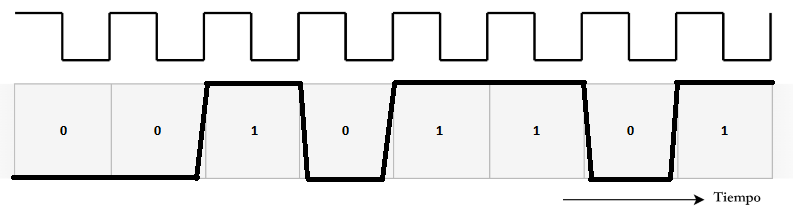
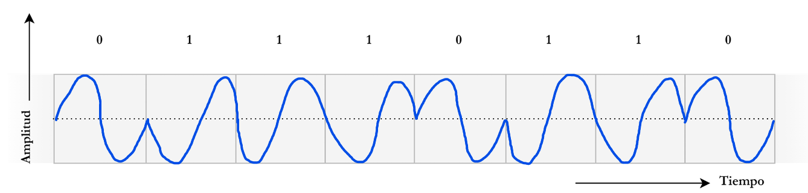

# Trabajo Práctico N° 1: Redes de Computadoras

**Integrantes:**
* Arias, Daniel Andrés
* Garzón, Pablo
* Gutierrez, Patricio
* Fernández y Fernández, Sergio Ezequiel
* Loza Denardi, Gabriel Jeremías
* Rocatagliatta, Leandro Agustin
* Zambellini, Matías Manuel

---

# Inciso 1

### Fundamentos de señales y comunicaciones

### Ondas electromagnéticas
Son ondas compuestas por campos eléctricos y magnéticos oscilantes que se propagan por el espacio transportando energía e información. Se caracterizan por su amplitud, frecuencia ($f$) y longitud de onda ($\lambda$), relacionadas mediante la ecuación:

$$c = \lambda \cdot f$$

### Modulación y demodulación
* **Modulación:** Proceso en el cual se modifica uno o más parámetros de una señal portadora analógica (amplitud, frecuencia o fase) en función de una señal moduladora que contiene los datos a transmitir.
* **Demodulación:** Proceso inverso que consiste en recuperar la información original a partir de la señal modulada recibida.

### Señales de tiempo continuo
Son señales definidas para cualquier instante dentro de un intervalo de tiempo continuo; típicamente se denotan como $x(t)$.

### Señales de tiempo discreto
Son señales definidas únicamente en instantes específicos, obtenidas generalmente mediante el muestreo periódico de una señal continua. Se representan como una secuencia $x[n]$, donde $n \in \mathbb{Z}$.

---

### Análisis del gráfico

* **a)** El gráfico representa la propagación en el espacio de una onda electromagnética periódica. El eje horizontal indica la distancia recorrida en milímetros ($\text{mm}$) y el eje vertical la amplitud de la señal. Los puntos ubicados en $60\text{ mm}$ y $120\text{ mm}$ corresponden a crestas consecutivas (misma fase), lo que permite calcular la longitud de onda. Además, se observa que la amplitud disminuye a medida que la onda recorre mayor distancia.

* **b)** Cálculo de longitud de onda ($\lambda$) y frecuencia ($f$):

$$\lambda = 120\text{ mm} - 60\text{ mm} = 60\text{ mm} = 0{,}06\text{ m}$$

$$c = 3 \times 10^8\text{ m/s}$$

$$f = \frac{c}{\lambda} = \frac{3 \times 10^8\text{ m/s}}{0{,}06\text{ m}} = 5 \times 10^9\text{ Hz} = 5\text{ GHz}$$
      
* **c)** Con una longitud de onda de $0{,}06\text{ m}$ ($f = 5\text{ GHz}$), la señal se ubica en la región de **microondas**. Según la clasificación de la ITU, pertenece a la banda **SHF** (*Super High Frequency*, Banda 10), que comprende las frecuencias entre $3\text{ GHz}$ y $30\text{ GHz}$.
      
* **d)** En la banda SHF operan tecnologías como Wi-Fi de alta velocidad (estándares 802.11a/n/ac/ax en $5\text{ GHz}$), enlaces de microondas terrestres, radares y comunicaciones satelitales. Un ejemplo cotidiano es un router Wi-Fi funcionando en la banda de $5\text{ GHz}$.

* **e)** La línea de trazos roja representa la **atenuación de la señal**. A medida que la onda electromagnética se propaga y se aleja de la fuente emisora, pierde energía y su amplitud disminuye progresivamente.

* **f)** La atenuación afecta de forma directa a las conexiones Wi-Fi. En la práctica, al alejarse del router o al haber paredes de por medio, la señal recibida pierde potencia, provocando que la velocidad de conexión baje o se vuelva inestable.

* **g)**
  * **i. Telefonía celular:** Sí, la señal se atenúa por la distancia a la antena base y al atravesar obstáculos urbanos como edificios y muros.
  * **ii. Cable coaxial:** Sí, sufre atenuación continua debido a la resistencia de los conductores de cobre y a pérdidas en el material dieléctrico.
  * **iii. Fibra óptica:** Presenta una atenuación mucho menor que los cables de cobre, pero no es nula. Ocurre por dispersión de la luz en el vidrio, impurezas del material o curvaturas pronunciadas en la instalación.

---

# Inciso 2

* **a)** Según la dirección del flujo de datos, es una comunicación **simplex (unidireccional)**, ya que la información viaja solo del transmisor al receptor. Según las características temporales, es una comunicación **síncrona**, ya que ambos dispositivos comparten una línea de reloj (*clock*) que marca cuándo leer cada bit.

* **b)** Para una transmisión rápida y bidireccional, el esquema síncrono es más conveniente que el asíncrono. Al contar con sincronismo de reloj constante, no se desperdicia ancho de banda enviando bits de inicio (*start*) y fin (*stop*) por cada byte, lo que permite enviar paquetes de datos más grandes con mayor velocidad útil.

* **c)** Para el nombre de grupo `Los-Tios-Networks`, el cuarto carácter es el guion medio (`-`):
  * ASCII: `45` (decimal) / `0x2D` (hexadecimal).
  * Binario (8 bits): `00101101`.

* **d)** Debido a que los cambios de nivel de tensión tienen pendientes en los flancos de subida y bajada, la señal debe medirse en el **centro del intervalo de bit**, instante en el cual la tensión ya se encuentra estabilizada en un valor lógico claro.

---

# Inciso 3

Transmitir de manera inalámbrica una señal escalonada (digital directa) presenta varias desventajas técnicas:

* **Gran requerimiento de ancho de banda:** Las señales escalonadas tienen un contenido espectral con muchos armónicos de alta frecuencia, lo que requeriría un ancho de banda impráctico en el medio inalámbrico.
* **Atenuación dependiente de la frecuencia:** Los armónicos de alta frecuencia se atenúan mucho más rápido que las frecuencias bajas, deformando los pulsos cuadrados y dificultando su lectura en el receptor.
* **Distorsión por retardo:** Las distintas componentes de la señal viajan a velocidades ligeramente diferentes por el aire, provocando que los pulsos se ensanchen e interfieran entre sí.
* **Sensibilidad al ruido:** En transmisiones inalámbricas directas sin modular, cualquier interferencia electromagnética o ruido impulsivo corrompe fácilmente los niveles lógicos.

### Análisis de modulación

* **a)** La técnica representada es **Modulación por Desplazamiento de Fase (PSK - *Phase Shift Keying*)**, identificable por los saltos de fase de $180^\circ$ en cada cambio de estado de los bits.

* **b)** Señal modulada resultante:

* **c)** Otras modulaciones digitales basadas en portadoras sinusoidales son:
  * **ASK (*Amplitude Shift Keying*):** Modulación por desplazamiento de amplitud.
  * **FSK (*Frequency Shift Keying*):** Modulación por desplazamiento de frecuencia.
  * **QAM (*Quadrature Amplitude Modulation*):** Modulación combinada de amplitud y fase.

* **d)** El **BER (*Bit Error Rate*)** es la relación entre la cantidad de bits recibidos con error y el total de bits transmitidos en un intervalo de tiempo. 
  
  Entre las tres técnicas básicas, **PSK ofrece el mejor desempeño en cuanto a BER**, ya que la información se transporta en los cambios de fase, haciéndola más inmune al ruido y a las fluctuaciones de amplitud que ASK y FSK.

---

# Inciso 4

* **c)** El router opera en la frecuencia de **$2{,}4\text{ GHz}$**, perteneciente a la banda de **Ultra Alta Frecuencia (UHF)**. Esta frecuencia se encuentra dentro del rango de microondas (longitud de onda de aprox. $\lambda \approx 12{,}5\text{ cm}$) y se utiliza ampliamente en bandas libres ISM para comunicaciones inalámbricas de corto y mediano alcance.

* **g)** Se configuró la topología con el router inalámbrico, la PC conectada por cable FastEthernet y la Notebook 1 conectada por Wi-Fi:
  * **Direccionamiento IP:** Ambos equipos obtuvieron su configuración de red en la subred `192.168.0.0/24` de manera automática por DHCP a través del router (`192.168.0.1`).
  * **Prueba de conectividad (`ping`):** Se enviaron 4 paquetes desde la PC (`192.168.0.100`) hacia la Notebook 1 (`192.168.0.102`), recibiendo las 4 respuestas correctamente ($0\%$ de pérdida, tiempo promedio de $25\text{ ms}$).
  * **Ruta (`tracert`):** El comando confirmó la comunicación directa en un solo salto dentro de la misma red local.

* Configuración IP en la PC: 
* Configuración IP en la Notebook 1: 
* Pruebas de Ping y Traceroute: 

* **h)** Pruebas de cobertura inalámbrica con la Notebook 2:
  * **Dentro del límite de cobertura:** A pesar de ubicarse cerca del borde de la señal, la notebook mantuvo la conexión inalámbrica y obtuvo IP por DHCP. La prueba de `ping` desde la PC fue exitosa con $0\%$ de paquetes perdidos.
  * **Fuera del área de cobertura:** Al alejar la notebook más allá del rango de la señal Wi-Fi, se perdió la conexión inalámbrica con el router. Como consecuencia, las pruebas de `ping` fallaron completamente por tiempo de espera agotado (`Request timed out`, $100\%$ de pérdida).

* Notebook 2 en el límite de cobertura: 
* Notebook 2 fuera del área de cobertura: 