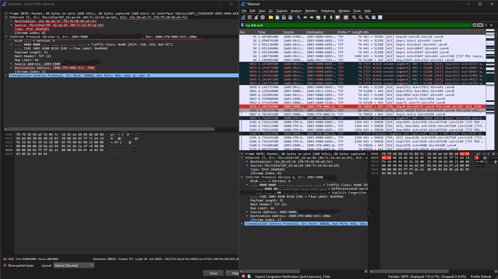
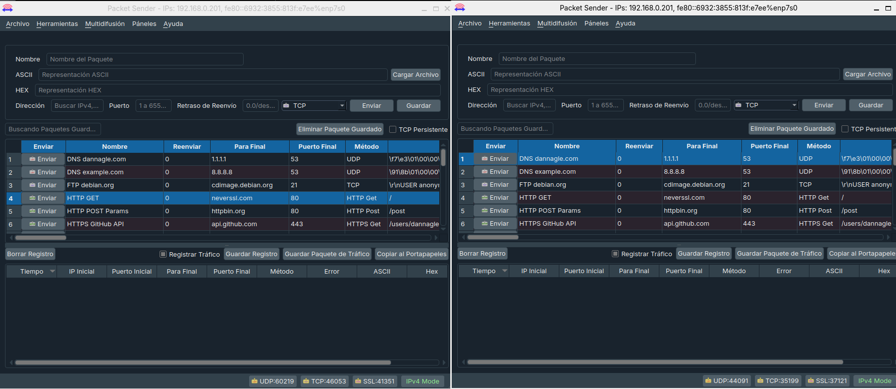
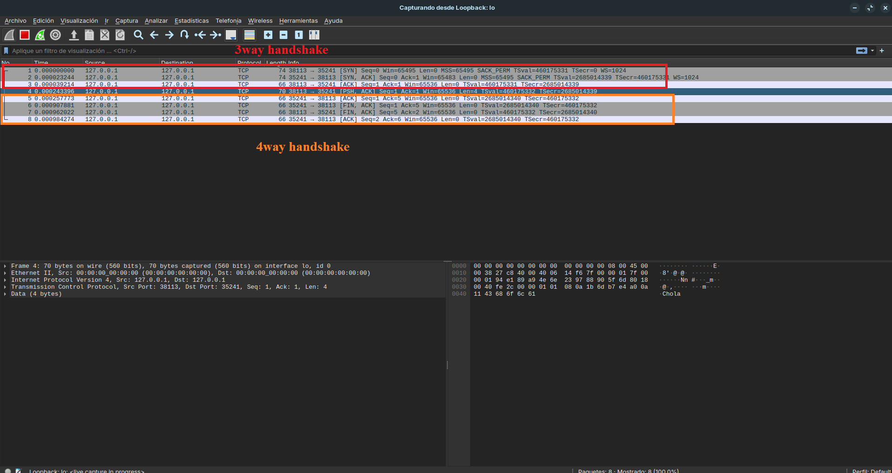
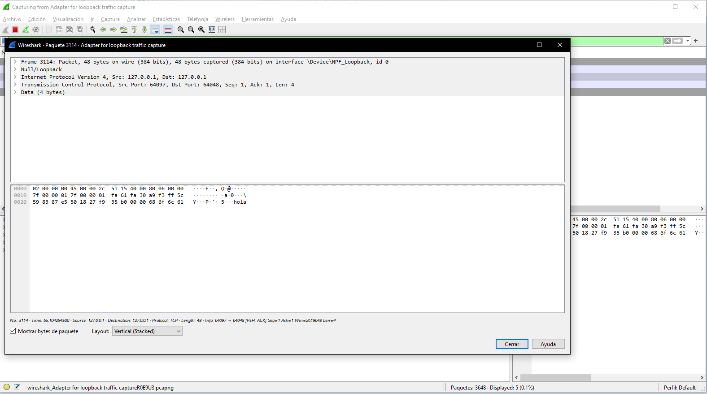

# Trabajo Práctico N° 2: Redes de Computadoras

**Integrantes:**
* Arias, Daniel Andrés
* Garzón, Pablo
* Gutierrez, Patricio
* Fernández y Fernández, Sergio Ezequiel
* Loza Denardi, Gabriel Jeremías
* Rocatagliatta, Leandro Agustin
* Zambellini, Matías Manuel

---

# Inciso 1

**a)** La capa de enlace es la encargada de permitir la comunicación entre dispositivos que se encuentran dentro de una misma red local. Para hacerlo, toma la información que recibe de la capa de red y la organiza en tramas, agregando información necesaria para que pueda ser enviada por el enlace. Además, utiliza las direcciones MAC para identificar al dispositivo de origen y al dispositivo de destino dentro de esa red local. De esta forma, resuelve la comunicación entre nodos conectados al mismo enlace.

**b)** Una dirección MAC es una identificación que utiliza la capa de enlace para reconocer una interfaz de red dentro de una red local. Sirve para que las tramas puedan llegar al dispositivo correcto dentro de ese enlace. En cambio, la dirección IP pertenece a la capa de red y permite identificar lógicamente el origen y el destino de una comunicación, incluso cuando los equipos se encuentran en redes distintas. Por eso, la MAC se utiliza principalmente para la comunicación local, mientras que la IP permite la comunicación entre distintas redes. Por ejemplo, si mi computadora quiere comunicarse con un servidor en Internet, la MAC destino de la trama normalmente será la del router o gateway, mientras que la IP destino será la del servidor final.

**c)** Una trama Ethernet es la unidad de información que utiliza la capa de enlace para transportar datos dentro de una red local. La capa de enlace toma el paquete proveniente de una capa superior, por ejemplo un paquete IP, y lo encapsula, agregándole información necesaria para su direccionamiento, identificación y control durante la transmisión.
Sus campos principales son:

* Preámbulo: permite que el receptor se sincronice antes de comenzar a leer la trama.
* Dirección MAC destino: identifica la interfaz de red a la que debe llegar la trama dentro del enlace local.
* Dirección MAC origen: identifica la interfaz que envió la trama.
* EtherType o Tipo: indica qué protocolo de capa superior está encapsulado dentro de la trama, por ejemplo IPv4, IPv6 o ARP.
* Datos o Payload: contiene la información transportada, normalmente un paquete de capa de red como IP.
* FCS/CRC: permite detectar errores que hayan ocurrido durante la transmisión de la trama.

**d)** El campo EtherType permite identificar qué protocolo de capa superior está siendo transportado dentro de la trama Ethernet. Por ejemplo, puede indicar que el contenido corresponde a IPv4, IPv6 o ARP. De esta manera, el receptor sabe cómo interpretar los datos encapsulados y a qué protocolo entregarlos.

# Inciso 2
## Análisis con Wireshark

Se seleccionó una trama Ethernet con un paquete IPv6 encapsulado.

**a)** *Direcciones MAC de origen y destino*

En la trama Ethernet seleccionada, la dirección MAC de origen es 04:7c:16:42:ae:b4, identificada por Wireshark como MicroStarINT_42:ae:b4, correspondiente a la interfaz de red de nuestra computadora.
La dirección MAC de destino es f8:79:28:96:a5:7e, identificada por Wireshark como zte_96:a5:7e. Esta corresponde al router ZTE de nuestra red local, que en esta comunicación funciona como gateway para poder salir hacia Internet.

**b)** *Direcciones IP de origen y destino*

Dentro de la trama Ethernet se encuentra encapsulado un paquete IPv6. La dirección IPv6 de origen corresponde a nuestra computadora (2803:9800:..., censurada en la captura), mientras que la dirección IPv6 de destino es 2800:3f0:4002:815::200a, correspondiente al host remoto con el cual se está realizando la comunicación.

**c)** *Comparación entre MAC e IP*

Las direcciones MAC y las direcciones IP no representan lo mismo. Las direcciones MAC trabajan en la capa de enlace y se utilizan para entregar la trama dentro del enlace o red local. En cambio, las direcciones IP trabajan en la capa de red e identifican el origen y el destino de la comunicación a través de distintas redes.
En nuestra captura se puede observar esta diferencia: la MAC destino corresponde al router ZTE, ya que es el siguiente dispositivo al que nuestra computadora debe entregar la trama dentro de la red local, mientras que la IPv6 destino corresponde al servidor remoto al que realmente queremos llegar a través de Internet.

# Inciso 3
**a)** El problema que resuelve TCP que Ethernet ni IP logran es la supervision de bloques de datos para asegurar que todos se entreguen de forma fiable.
Muchas aplicaciones aplicaciones requieren de un protocolo extremo-a-extremo fiable.Aunque, las haya algunas que pueden prescindir de ellas y usar otros protocolos como solo IP.

**b)** *Campos de metadata en frame TCP*
- Puertos de destino: Estos 2 valores identifican a los puntos de emisión y recepción, la combinacion de una dirección IP y un puerto es llamada Socket.
- Número de secuencia: El protocolo TCP numera secuencialmente los segmentos que envía a un destino, en caso de que lleguen desordenados, este puerto destino puede reordenarlos
- Número de ACK: Contiene el valor del siguiente número de secuencia que el emisor del segmento espera recibir.
-  Longitud de cabecera: Especifica el tamaño de la cabecera en palabras de 32 bits.
-  Reservado: Para uso futuro. Debe estar a 0.
-  Tamaño de ventana: Tamaño de la ventana de recepción que especifica el número máximo de bytes que pueden ser metidos en el buffer de recepción o dicho de otro modo, el número máximo de bytes pendientes de asentimiento. Es un sistema de control de flujo.
-  Suma de verificación: Checksum utilizado para la comprobación de errores tanto en la cabecera como en los datos.
-  Puntero urgente: Cantidad de bytes desde el número de secuencia que indica el lugar donde acaban los datos urgentes.
- Opciones: Nos permite añadir características no cubiertas por la cabecera fija.
- Relleno: Se utiliza para asegurarse que la cabecera acaba con un tamaño múltiplo de 32 bits.

**c)** *Three y Four way Handshake*

Three way Handshake : Es un proceso utilizado por el protocolo TCP para establecer una conexion fiable entre un emisor y un receptor previo al comienzo de la transmision de bloques de datos. Sincroniza números de secuencias y se asegura que ambos puntos esten lintos
para el intercambio de datos.

En resumen, este handshake consiste en 3 pasos: Primero, se envia al receptor un segmento con la flag SYN indicando la intención de iniciar una comunicacion del emisor, segundo, el receptor 
responde con las flags SYN y ACK, este úiltimo representa la afirmacion del receptor para el intercambio de datos, por ultimo, el emisor confirma la recepción de la respuesta y se inicia la transferencía de datos. 

Four way Handshake: A diferencia de un 3-way handshake,que inicia una comunicación TCP, el 4-way handshake se usa para terminar una comunicación del mismo protocolo.
Dado que TCP es bidireccional, cada extremo debe finalizar su propio envío por separado.Para ello, un extremo envía un segmento con el flag FIN y el otro responde con un ACK, luego, el segundo extremo envia su propio segmento con FIN, el cual es confirmado con un último
ACK por parte del primero, terminando asi la comunicación

**d)** *Envio de paquete y uso de Wireshark*

Cliente y servidor TCP de Packet Sender

3way y el 4way handshake.

Carga util del paquete.

**d)** *EtherType*

El campo EtherType de la trama tiene el valor 0x86dd, lo que indica que el protocolo encapsulado dentro de la trama Ethernet es IPv6. De esta manera, al recibir la trama, la capa de enlace puede determinar que los datos contenidos deben ser procesados por el protocolo IPv6 de la capa de red.
