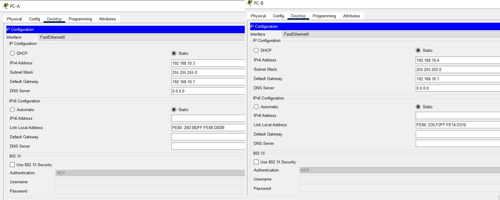
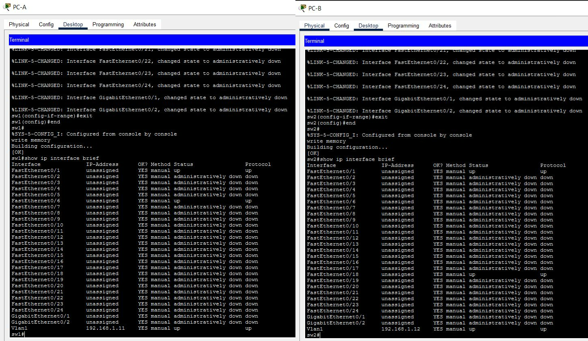

# Trabajo Práctico N° 4: Redes de Computadoras

**Integrantes:**
* Arias, Daniel Andrés
* Garzón, Pablo
* Gutierrez, Patricio
* Fernández y Fernández, Sergio Ezequiel
* Loza Denardi, Gabriel Jeremías
* Rocatagliatta, Leandro Agustin
* Zambellini, Matías Manuel

---

# Inciso 1

**a)** Las redes, según su alcance, pueden clasificarse en:

* **PAN (Personal Area Network):** Son redes informáticas de pocos metros. Son las más básicas y sirven para espacios reducidos. El ejemplo más claro para este tipo de redes es la señal Bluethoot.

* **LAN (Local Area Network):** Es el tipo de red que suele instalarse en la mayoría de los hogares y oficinas. Pueden abarcar desde 200 metros hasta 1 Kilómetro de cobertura. Son veloces y de fácil configuración.

* **MAN (Metropolitan Area Network):** Son redes similares a las LAN, pero utilizadas para cubirir mucha más área que ellas. Son varias LAN instaladas en áreas específicas interconectadas entre sí para que puedan intercambiar datos de forma rápida y eficiente.

* **WAN (Wide Area Network):** Son redes que abarcan distancias mucho mayores. Conectan ciudades, países, continentes. El ejemplo más claro es el Internet. Ofrecen un gran alcance, pero son más vulnerables y suelen ser menos rápidas que las LAN.

* **SAN (Storage Area Network):** Son redes propias de empresas que trabajan con servidores y no quieren perder rendimiento en el tráfico del usuario, ya que manejan una gran cantidad de datos. Son muy utilizadas por empresas tecnológicas.

* **VLAN (Virtual Local Area Network):** Explicadas en el próximo inciso del ejercicio.

**b)** Una **`VLAN`** es una tecnología de redes que permite crear redes lógicas independientes dentro de la misma red física. Su principal objetivo es segmentar adecuadamente una red y usar cada subred de forma diferente.
Las `VLAN` se clasifican en:

* *`VLAN de nivel 1 (por puerto):`* También conocida como `port switching`. Se especifica qué puertos del switch corresponden a esa VLAN; y los miembros de la misma son los que se conectan a esos puertos. No permite la movilidad de los usuarios; si el usuario se mueve físicamente, sería necesario reconfigurar la subred.

* *`VLAN de nivel 2 por direcciones MAC:`* Se asignan hosts a la VLAN según su dirección MAC. No es necesario reconfigurar la subred si el usuario cambia su ubicación (se conecta a otro puerto de ese u otro dispositivo). Su principal inconveniente es que se debe asignar los usuarios de a uno en uno.

* *`VLAN de nivel 3 por tipo de protocolo:`* La VLAN queda determinada por el contenido del campo `protocolo` de la trama MAC (IPv4 para VLAN 1, IPv6 para VLAN 2, etc.).

* *`VLAN de nivel 4 por direcciones de subred (subred virtual):`* La cabecera de nivel 3 se utiliza para mapear la VLAN a la que pertenece. En este tipo de VLAN, los paquetes son los que pertenecen a ella y no las estaciones.

* *`VLAN de niveles superiores:` Se crea una VLAN para cada aplicación (flujos multimedia, correos electrónicos, etc.). La pertenencia  la VLAN se puede basar en una combinación de factores como puertos, direcciones MAC, subred, hora del día, etc.

**c)** El protocolo **`IEEE 802.1Q`** es el estándar internacional que define el etiquetado de las VLAN en tramas Ethernet para permitir que múltiples redes lógicas compartan una misma infraestructura física.

Consiste en:

* *`Etiquetado de tramas:`* Inserta una etiqueta adcional de 4 bytes (32 bits) en la trama `Ethernet` original, situada entre la dirección MAC de origen y el campo de tipo/longitud.

* *`Identificador (VLAN ID):`* Contiene un campo numérico de 12 bits que permite identificar a qué red virtual pertenece exactamente la trama. Soporta hasta 4096 VLANs distinas.

* *`Enlaces troncales (Trunking):`* Se usa principalmente en los puertos troncales que conectan switches o routers. De esta forma, permite que un solo cable físico transporte simultáneamente el tráfico de diferentes VLANs sin que se mezclen entre sí.

También incluye un campo de prioridad llamado **`Priority Code Point (PCP)`** que permite priorizar datos. Y ayuda a segmentar el tráfico en la red, reduciendo la congestión y aislando información entre diferentes departamentos o usuarios.

**d)** El `tagging` es el proceso de insertar una identifiación numérica dentro de la trama Ethernet del paquete de datos para poder identificar a qué VLAN pertenece. Esta etiqueta es la de 4 bytes que se ubica entre la dirección MAC de origen y el campo de tipo/longitud, mencionada en el inciso anterior (`Etiquetado de tramas`).

Se compone de:

* *`TPID (Tag Protocol Identifier - 2 bytes):`* Tiene un valor fijo (`0x8100`) y le avisa al siguiente dispositivo de red, como un switch o router, que la trama está etiquetada bajo el protocolo IEEE 802.1Q.

* *`TCI (Tag Control Identifier - 2 bytes):`* Contiene información importante dividida en:

    * **Prioridad del usuario (3 bits):** Clasifica el tráfico mediante el protocolo mencionado para dar prioridad a algunos datos.

    * **Indicador Formal y Canónico (1 bit):** Indica si las direcciones MAC están en formato canónico o no.

    * **VID (VLAN ID - 12 bits):** Es el número de identifiación de la VLAN que pertenece a la trama (0 - 4095).

El `tagging` es necesario para el `Trunking` ya mencionado (permite al switch receptor saber a qué VLAN especifica redirigir cada trama). También permite segmentar las redes físicas de forma lógica sin requerir un cableado independiente por cada grupo de dispositivos.

---

# Inciso 2

## 1. Topología y Configuración Inicial (Incisos a - g)

Para resolver este ejercicio, armamos la topología solicitada en Cisco Packet Tracer compuesta por dos computadoras (`PC-A` y `PC-B`) conectadas a dos switches (`SW-1` y `SW-2`), interconectados mediante un enlace troncal en sus puertos `FastEthernet 0/1`.

### a) Configuración de nombres
Ingresamos a la terminal de cada switch para asignarles sus respectivos hostnames (`sw1` y `sw2`).

### b) y c) Configuración y encriptación de contraseñas
Definimos las contraseñas de consola, modo privilegiado (`enable secret`) y líneas VTY, aplicando posteriormente el comando de encriptación general (`service password-encryption`).

### d) Configuración de red VLAN inicial
Asignamos las direcciones IP iniciales de gestión sobre la VLAN 1 por defecto según la tabla de ruteo provista (`192.168.1.11` para SW-1 y `192.168.1.12` para SW-2).

### e) y f) Desactivación de puertos libres y guardado
Apagamos administrativamente todas las interfaces físicas que no se encontraban en uso en los switches y guardamos los cambios ejecutando `write memory`.

### g) Testeo inicial de comunicación
Realizamos pings de prueba iniciales entre las computadoras antes de segmentar el tráfico en VLANs.

* **Configuración de las computadoras:**

* **Configuración de los Switches:**

* **Primera Prueba de Ping:** Puede verse que ambas computadoras están correctamente conectadas mediante los switches.

---

## 2. Creación de VLANs y Listado (Incisos h - i)

### h) Creación de VLANs en ambos switches
Creamos las tres VLANs institucionales solicitadas en ambos equipos (`sw1` y `sw2`):
* **VLAN 10:** Laboratorio
* **VLAN 20:** Bar
* **VLAN 99:** Management

### i) Visualización con show vlan brief y VLAN por defecto
Al ejecutar el comando `show vlan brief`, se visualiza la lista de VLANs activas. 
* **VLAN utilizada por defecto:** Todos los puertos físicos de los switches pertenecen inicialmente a la **VLAN 1 (default)**.

---

## 3. Asignación de Puertos de Acceso y Enlaces Troncales (Inciso j)

### j) Asignación de la PC-A a la VLAN Laboratorio
Configuramos el puerto `FastEthernet 0/6` del `sw1` en modo acceso y lo asociamos a la VLAN 10, además de habilitar el puerto `FastEthernet 0/1` como enlace troncal (*trunk*).

---

## 4. Reubicación de la Gestión a la VLAN 99 y Verificación (Incisos k - l)

### k) Configuración de la IP de gestión en la VLAN 99 (SW-1)
Removemos la dirección IP de administración de la interfaz `Vlan1` y la configuramos de manera exclusiva en la interfaz `Vlan99` para el `sw1` (`192.168.1.11`).

### l) Verificación e interpretación de estados
Visualizamos los estados mediante `show vlan brief` y `show ip interface brief`.
* **Interpretación:** La interfaz lógica `Vlan1` queda sin dirección IP (*unassigned*), separando el tráfico de usuarios del tráfico de gestión. La interfaz `Vlan99` adquiere la IP asignada con un estado operativo en `up/up`.

---

## 5. Configuración de SW-2 y Pruebas de Conectividad Finales (Incisos m - n)

### m) Asignación de la PC-B y repetición de gestión en SW-2
* Asignamos el puerto `FastEthernet 0/18` del `sw2` a la **VLAN 10 (Laboratorio)**.
* Repetimos el procedimiento del inciso k para el `sw2`, removiendo la IP de la `Vlan1` y configurando la IP `192.168.1.12` en la `Vlan99`.

### n) Pruebas de conectividad mediante pings e interpretación
Realizamos las validaciones finales de la red:
1. **Ping entre PC-A y PC-B:** La prueba desde el Command Prompt arrojó un **0% de pérdida de paquetes**. 
   * *Interpretación:* Las computadoras se comunican de forma transparente a través de switches físicos distintos debido a que comparten la misma VLAN 10 y el enlace troncal (*trunk*) transporta el tráfico etiquetado correctamente.
2. **Ping entre SW-1 y SW-2:** La prueba de conectividad de administración desde la terminal del `sw1` hacia la IP `192.168.1.12` del `sw2` respondió con éxito total (`100%`).
   * *Interpretación:* Confirma que la red de gestión sobre la VLAN 99 opera sin inconvenientes entre ambos dispositivos de red.

---

# Inciso 3

