# Trabajo Práctico N° 4: Redes de Computadoras

**Integrantes:**
* Arias, Daniel Andrés
* Garzón, Pablo
* Gutierrez, Patricio
* Fernández y Fernández, Sergio Ezequiel
* Loza Denardi, Gabriel Jeremías
* Rocatagliatta, Leandro Agustin
* Zambellini, Matías Manuel

---

# Inciso 1

**a)** Las redes, según su alcance, pueden clasificarse en:

* **PAN (Personal Area Network):** Son redes informáticas de pocos metros. Son las más básicas y sirven para espacios reducidos. El ejemplo más claro para este tipo de redes es la señal Bluethoot.

* **LAN (Local Area Network):** Es el tipo de red que suele instalarse en la mayoría de los hogares y oficinas. Pueden abarcar desde 200 metros hasta 1 Kilómetro de cobertura. Son veloces y de fácil configuración.

* **MAN (Metropolitan Area Network):** Son redes similares a las LAN, pero utilizadas para cubirir mucha más área que ellas. Son varias LAN instaladas en áreas específicas interconectadas entre sí para que puedan intercambiar datos de forma rápida y eficiente.

* **WAN (Wide Area Network):** Son redes que abarcan distancias mucho mayores. Conectan ciudades, países, continentes. El ejemplo más claro es el Internet. Ofrecen un gran alcance, pero son más vulnerables y suelen ser menos rápidas que las LAN.

* **SAN (Storage Area Network):** Son redes propias de empresas que trabajan con servidores y no quieren perder rendimiento en el tráfico del usuario, ya que manejan una gran cantidad de datos. Son muy utilizadas por empresas tecnológicas.

* **VLAN (Virtual Local Area Network):** Explicadas en el próximo inciso del ejercicio.

**b)** Una **`VLAN`** es una tecnología de redes que permite crear redes lógicas independientes dentro de la misma red física. Su principal objetivo es segmentar adecuadamente una red y usar cada subred de forma diferente.
Las `VLAN` se clasifican en:

* *`VLAN de nivel 1 (por puerto):`* También conocida como `port switching`. Se especifica qué puertos del switch corresponden a esa VLAN; y los miembros de la misma son los que se conectan a esos puertos. No permite la movilidad de los usuarios; si el usuario se mueve físicamente, sería necesario reconfigurar la subred.

* *`VLAN de nivel 2 por direcciones MAC:`* Se asignan hosts a la VLAN según su dirección MAC. No es necesario reconfigurar la subred si el usuario cambia su ubicación (se conecta a otro puerto de ese u otro dispositivo). Su principal inconveniente es que se debe asignar los usuarios de a uno en uno.

* *`VLAN de nivel 3 por tipo de protocolo:`* La VLAN queda determinada por el contenido del campo `protocolo` de la trama MAC (IPv4 para VLAN 1, IPv6 para VLAN 2, etc.).

* *`VLAN de nivel 4 por direcciones de subred (subred virtual):`* La cabecera de nivel 3 se utiliza para mapear la VLAN a la que pertenece. En este tipo de VLAN, los paquetes son los que pertenecen a ella y no las estaciones.

* *`VLAN de niveles superiores:` Se crea una VLAN para cada aplicación (flujos multimedia, correos electrónicos, etc.). La pertenencia  la VLAN se puede basar en una combinación de factores como puertos, direcciones MAC, subred, hora del día, etc.

**c)** El protocolo **`IEEE 802.1Q`** es el estándar internacional que define el etiquetado de las VLAN en tramas Ethernet para permitir que múltiples redes lógicas compartan una misma infraestructura física.

Consiste en:

* *`Etiquetado de tramas:`* Inserta una etiqueta adcional de 4 bytes (32 bits) en la trama `Ethernet` original, situada entre la dirección MAC de origen y el campo de tipo/longitud.

* *`Identificador (VLAN ID):`* Contiene un campo numérico de 12 bits que permite identificar a qué red virtual pertenece exactamente la trama. Soporta hasta 4096 VLANs distinas.

* *`Enlaces troncales (Trunking):`* Se usa principalmente en los puertos troncales que conectan switches o routers. De esta forma, permite que un solo cable físico transporte simultáneamente el tráfico de diferentes VLANs sin que se mezclen entre sí.

También incluye un campo de prioridad llamado **`Priority Code Point (PCP)`** que permite priorizar datos. Y ayuda a segmentar el tráfico en la red, reduciendo la congestión y aislando información entre diferentes departamentos o usuarios.

**d)** El `tagging` es el proceso de insertar una identifiación numérica dentro de la trama Ethernet del paquete de datos para poder identificar a qué VLAN pertenece. Esta etiqueta es la de 4 bytes que se ubica entre la dirección MAC de origen y el campo de tipo/longitud, mencionada en el inciso anterior (`Etiquetado de tramas`).

Se compone de:

* *`TPID (Tag Protocol Identifier - 2 bytes):`* Tiene un valor fijo (`0x8100`) y le avisa al siguiente dispositivo de red, como un switch o router, que la trama está etiquetada bajo el protocolo IEEE 802.1Q.

* *`TCI (Tag Control Identifier - 2 bytes):`* Contiene información importante dividida en:

    * **Prioridad del usuario (3 bits):** Clasifica el tráfico mediante el protocolo mencionado para dar prioridad a algunos datos.

    * **Indicador Formal y Canónico (1 bit):** Indica si las direcciones MAC están en formato canónico o no.

    * **VID (VLAN ID - 12 bits):** Es el número de identifiación de la VLAN que pertenece a la trama (0 - 4095).

El `tagging` es necesario para el `Trunking` ya mencionado (permite al switch receptor saber a qué VLAN especifica redirigir cada trama). También permite segmentar las redes físicas de forma lógica sin requerir un cableado independiente por cada grupo de dispositivos.

---

# Inciso 2

### Topología Física
Se implementó la topología requerida utilizando dos switches Cisco 2960 (`SW-1` y `SW-2`) y dos computadoras (`PC-A` y `PC-B`), conectadas mediante cables directos y cruzados según las interfaces especificadas, más sus respectivas conexiones de consola para administración local.

* **Configuración de cada PC:**

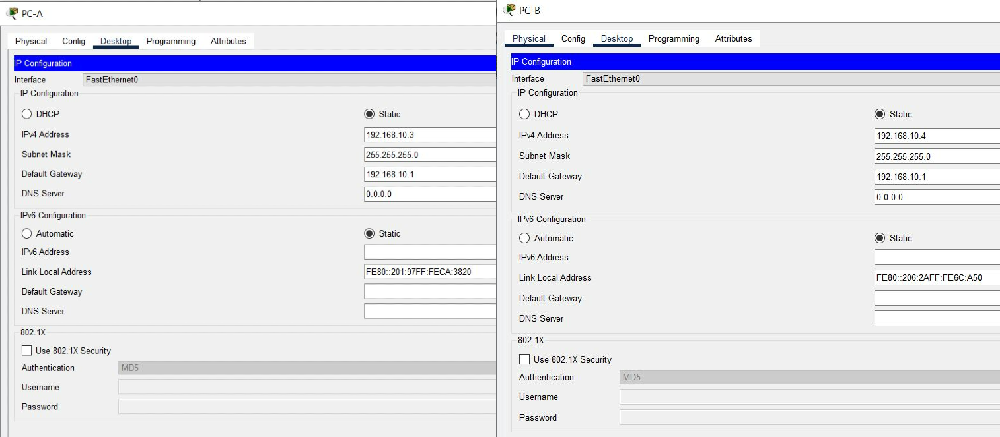

---

### Incisos a, b y c: Configuración Básica y Seguridad
Se accedió a la configuración global de ambos switches a través de las terminales de las PCs. Se asignaron los nombres `sw1` y `sw2`, se configuraron contraseñas para el modo privilegiado (`secret`), puerto de consola y líneas virtuales (`VTY`), y finalmente se habilitó el servicio de encriptación de contraseñas (`service password-encryption`).

---

### Incisos d, e y f: Configuración IP Inicial y Apagado de Puertos
Se configuraron las direcciones IP en la `VLAN 1` (por defecto) según la tabla de enrutamiento provista para ambos switches. Posteriormente, utilizando el comando `interface range`, se procedió a apagar (`shutdown`) todos los puertos físicos que no forman parte de la topología activa. La configuración se guardó exitosamente en memoria (`write memory`).

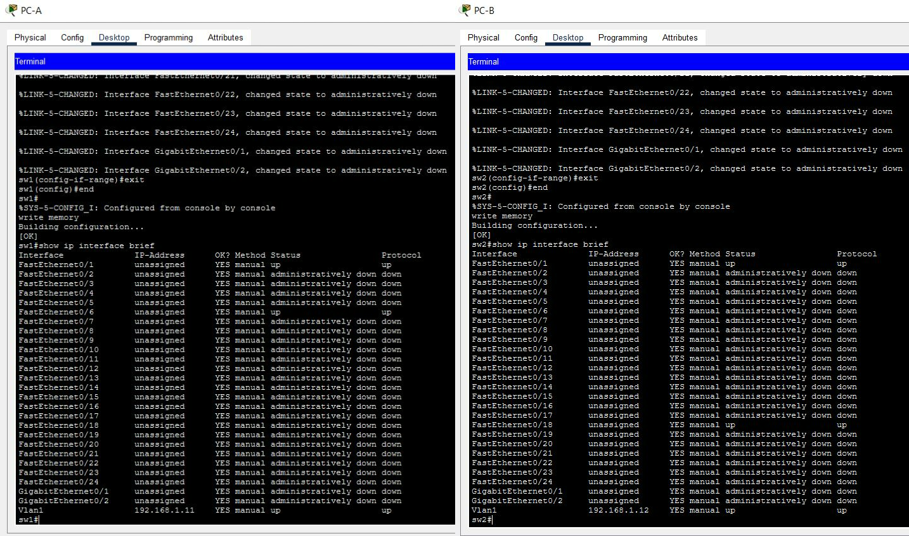

---

### Inciso g: Primera Prueba de Conectividad
Se realizaron pruebas de ping entre la `PC-A` y la `PC-B`. El resultado arrojó un **100% de éxito (0% loss)** en ambos sentidos. En este punto, la comunicación fluye correctamente ya que todos los equipos y puertos pertenecen a la VLAN 1 nativa y no existe segmentación lógica.

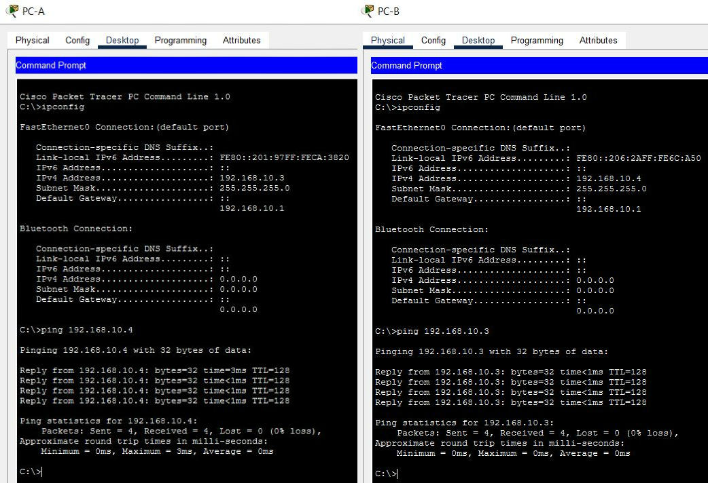

---

### Incisos h e i: Creación y Verificación de VLANs
Se crearon las VLANs 10 (`Laboratorio`), 20 (`Bar`) y 99 (`Management`) en ambos dispositivos.

Al ejecutar el comando `show vlan brief` para verificar el estado, se responde a la pregunta teórica del inciso **i**: **La VLAN utilizada por defecto es la VLAN 1 (default)**. Esto se evidencia al observar que la totalidad de las interfaces FastEthernet y GigabitEthernet se encuentran asignadas inicialmente a esta VLAN.

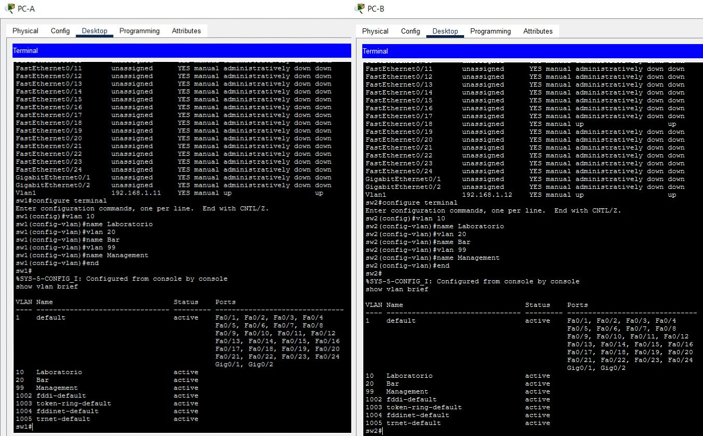

---

### Inciso j: Asignación de PC-A a VLAN 10
Se configuró el puerto `Fa0/6` del `sw1` en modo acceso y se lo asignó específicamente a la VLAN 10 (`Laboratorio`). La ejecución del comando `show vlan brief` confirma que el puerto `Fa0/6` migró de la VLAN 1 a la VLAN 10 exitosamente.

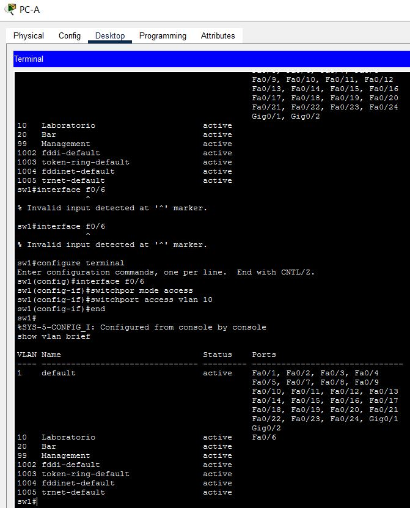

---

### Incisos k y l: Migración de IP de Management en sw1 e Interpretación
Se removió la dirección IP asignada previamente a la `Vlan 1` y se reconfiguró la interfaz lógica `Vlan 99` con la IP `192.168.1.11` correspondiente al SW-1.

**Interpretación de resultados:**
*   **show vlan brief:** Muestra la VLAN 99 activa, conteniendo la lógica de administración del dispositivo.
*   **show ip interface brief:** Verifica que la interfaz `Vlan1` quedó en estado *unassigned*, mientras que la `Vlan99` adquirió correctamente la IP de gestión. Es normal y esperado que el protocolo de la `Vlan99` figure temporalmente en estado *down*, ya que aún no posee un puerto físico activo habilitado para cursar su tráfico.

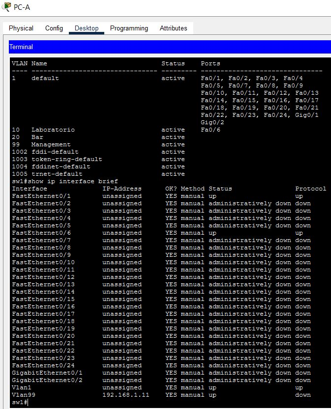

---

### Inciso m: Asignación de PC-B y Migración de IP en sw2
Se replicaron las configuraciones lógicas en el `sw2`: se asignó el puerto `Fa0/18` (`PC-B`) a la VLAN 10 (`Laboratorio`) en modo acceso, se eliminó la IP de la `Vlan 1`, y se configuró la IP `192.168.1.12` en la interfaz lógica `Vlan 99`. Los resultados de la verificación coinciden con lo analizado en el SW-1.

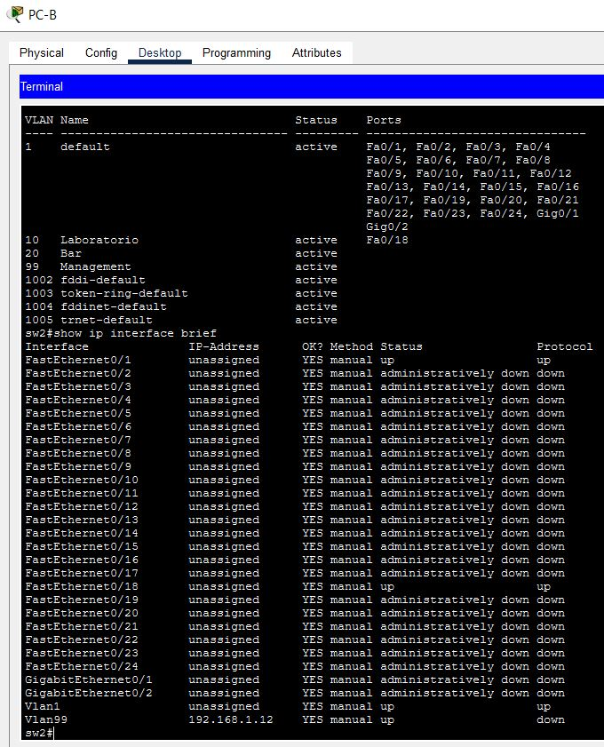

---

### Inciso n: Pruebas de Conectividad Finales e Interpretación
Al llegar a este punto y realizar los comandos `ping` habiendo seguido estrictamente los pasos de la guía, se obtienen los siguientes resultados:
*   El ping entre las computadoras (`PC-A` y `PC-B`) **falla** (`Request timed out`).
*   El ping entre las IPs de gestión de los switches **falla** (`Success rate is 0 percent`).

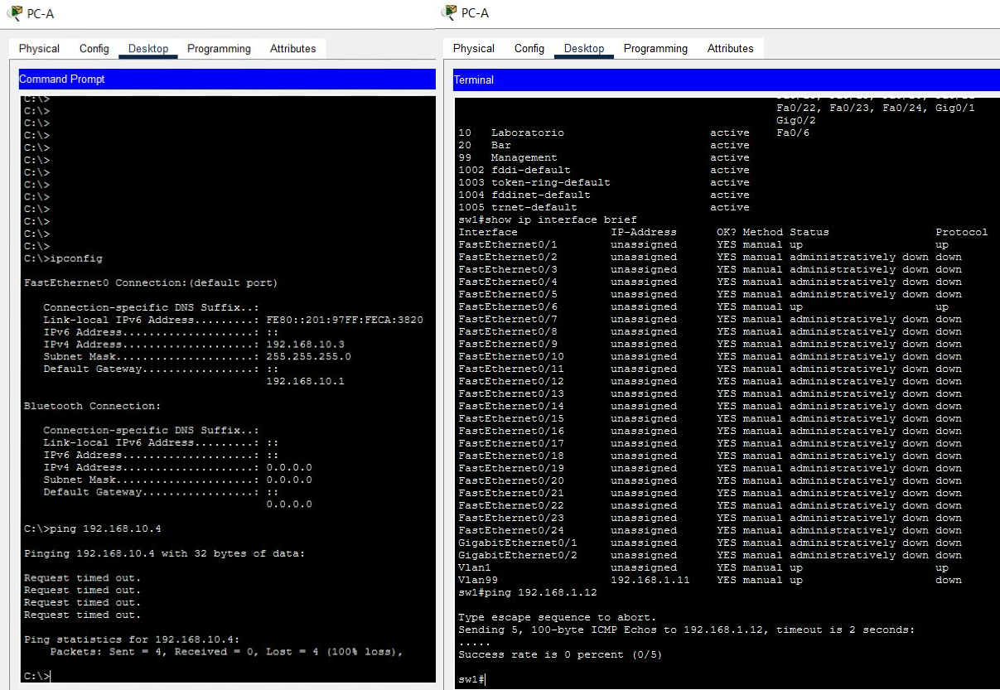

**Interpretación del problema:** 
Esta falla de comunicación es el comportamiento esperado debido a la segmentación lógica impuesta. Las PCs ahora se encuentran aisladas en la VLAN 10 y las interfaces de administración en la VLAN 99. Sin embargo, el enlace físico que interconecta los switches (`Fa0/1`) permanece en su configuración por defecto como puerto de acceso en la VLAN 1. 

Al no haberse configurado este enlace de interconexión como un puerto troncal (`modo Trunk`, bajo el estándar IEEE 802.1Q), el puerto descarta y no permite el cruce del tráfico etiquetado correspondiente a las VLANs 10 y 99. En consecuencia, las tramas quedan aisladas localmente dentro de cada switch sin alcanzar el otro extremo de la red.

---

# Inciso 3

### Topología utilizada

Se armó en Packet Tracer una red LAN simulando la red interna de una aeronave. La red se dividió en tres grupos mediante VLANs:

* **VLAN 10 - Turista:** acceso al servidor de entretenimiento.
* **VLAN 20 - Business:** acceso al servidor de entretenimiento y a Internet.
* **VLAN 99 - Administración:** acceso total.

La topología está formada por un switch, un router principal (`Router Aircraft`), un router que representa al ISP, un servidor de entretenimiento y distintas PCs para cada clase.

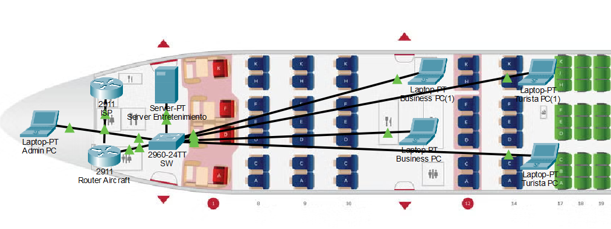

---

### Configuración del Router Aircraft

Para comunicar las VLANs se utilizaron subinterfaces sobre la interfaz conectada al switch.

Se configuraron:

* `G0/0.10` con IP `10.10.10.1`
* `G0/0.20` con IP `10.10.20.1`
* `G0/0.99` con IP `10.10.99.1`

Estas direcciones funcionan como gateway de cada red.

También se configuró `G0/1` con la IP `200.0.0.1/30` para conectar el router con el ISP.

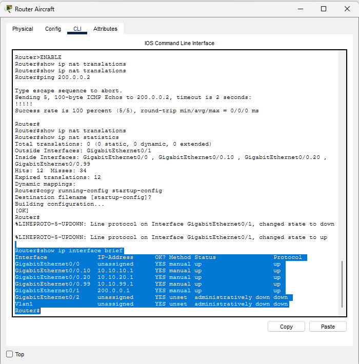

---

### Configuración del switch

En el switch se crearon las VLAN 10, 20 y 99.

Los puertos quedaron asignados de la siguiente forma:

* `Fa0/2 - Fa0/3` → VLAN 10 (Turista)
* `Fa0/4 - Fa0/5` → VLAN 20 (Business)
* `Fa0/6 - Fa0/7` → VLAN 99 (Admin)

El puerto `Fa0/1`, que conecta el switch con el Router Aircraft, se configuró como trunk para transportar las tres VLAN.

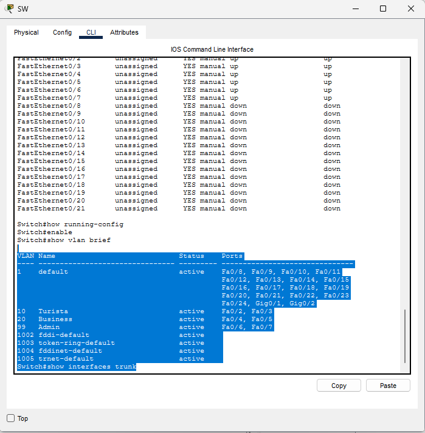

---

### Configuración DHCP

En el Router Aircraft se configuró DHCP para entregar direcciones IP automáticamente a los equipos.

Se utilizaron tres pools:

* Turista: `10.10.10.0/24`
* Business: `10.10.20.0/24`
* Admin: `10.10.99.0/24`

También se reservaron las primeras direcciones de cada red para no asignarlas automáticamente.

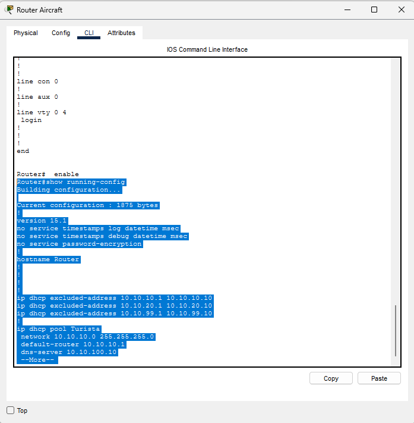

---

### Configuración de subinterfaces y NAT

Las subinterfaces del Router Aircraft se configuraron utilizando `dot1Q` para asociar cada una con su VLAN correspondiente.

Las interfaces internas fueron configuradas con `ip nat inside`, mientras que la interfaz conectada al ISP se configuró con `ip nat outside`.

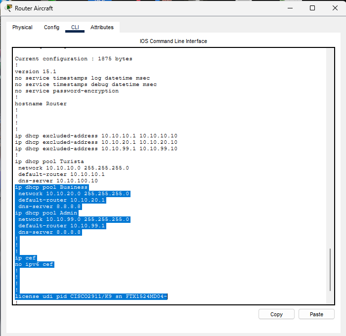

Se configuró NAT para las redes Business y Administración, permitiendo que ambas tengan acceso a la red externa usando la dirección de la interfaz `G0/1`.

La red Turista no fue incluida en esta configuración.

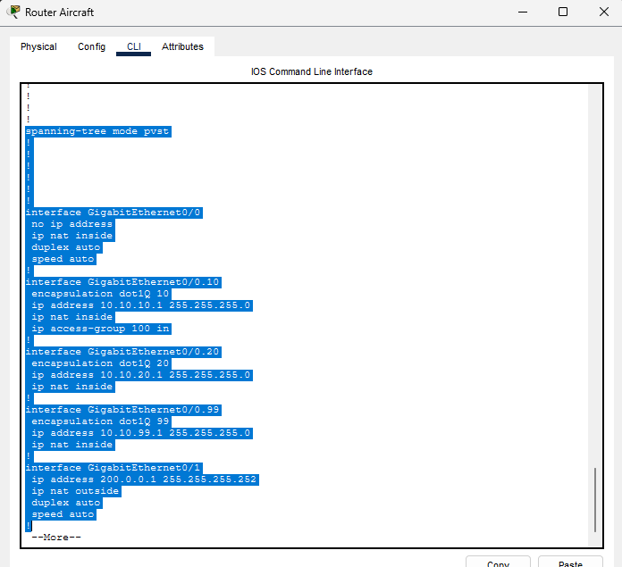

---

### Configuración de ACL para Turista

Se creó una ACL para limitar el acceso de la VLAN 10.

La regla permite que los equipos Turista accedan a la red `10.10.99.0/24`, donde se encuentra el servidor de entretenimiento, pero bloquea el tráfico hacia otros destinos.

La ACL se aplicó sobre la subinterfaz `G0/0.10`.

También se agregó una ruta por defecto hacia el ISP utilizando la dirección `200.0.0.2`.

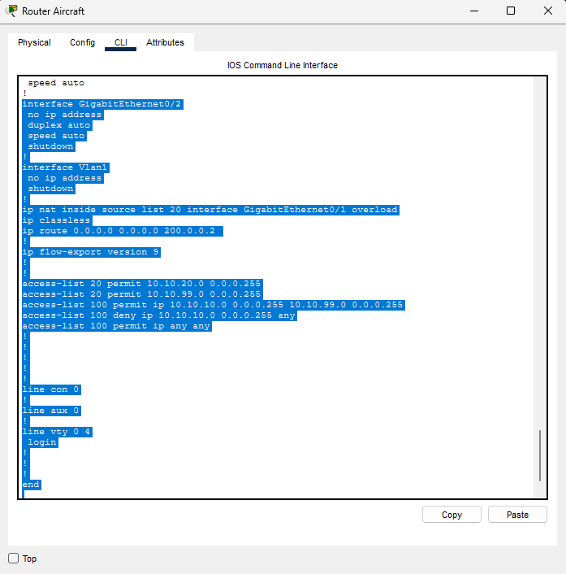

---

### Pruebas desde Turista

Desde una PC Turista se realizaron pruebas hacia el servidor y hacia el ISP.

El ping al servidor `10.10.99.10` respondió correctamente.

En cambio, el ping hacia `200.0.0.2` fue bloqueado, como se esperaba.

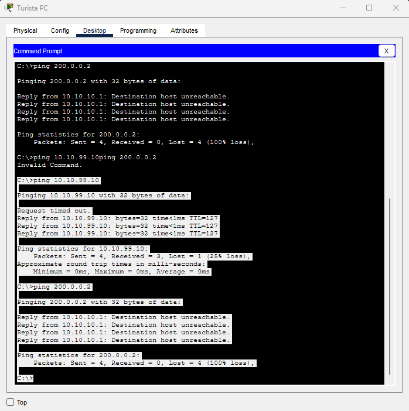

---

### Pruebas desde Business

Desde una PC Business se comprobó acceso al servidor de entretenimiento y también al ISP.

Los dos pings respondieron correctamente.

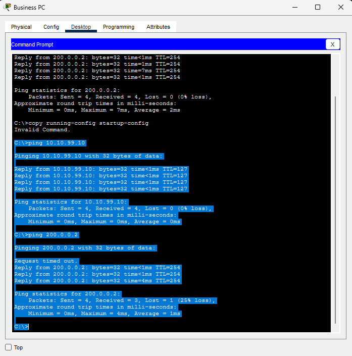

---

### Pruebas desde Administración

Desde la PC de Administración se realizaron pings a equipos Turista, Business y al servidor.

Todos respondieron correctamente.

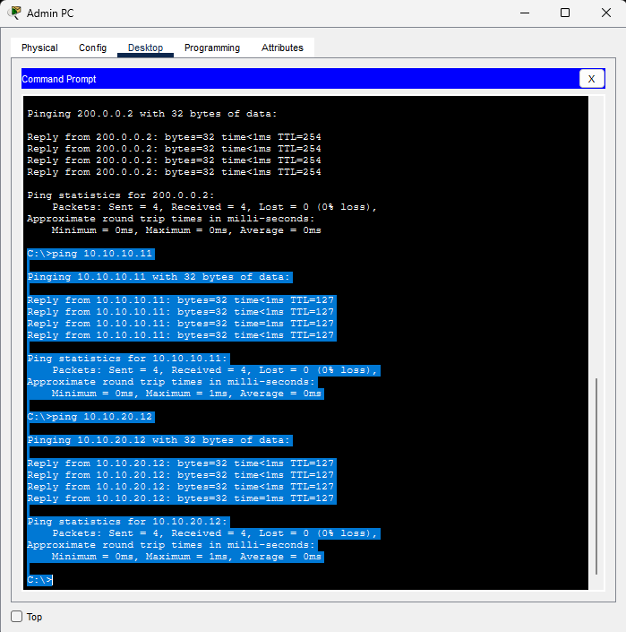

También se probó el acceso al ISP y el resultado fue correcto.

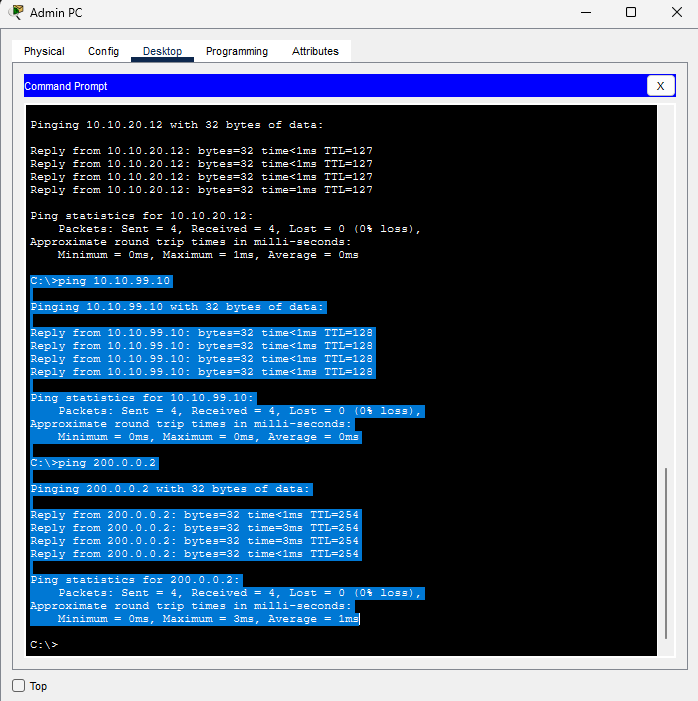

---

### Servidor de entretenimiento

El servidor fue configurado con la IP fija `10.10.99.10`.

Se activó el servicio HTTP y se modificó la página principal para simular un sistema de entretenimiento llamado **AirConnect Entertainment**.

Desde una PC Turista se pudo acceder correctamente mediante el navegador.

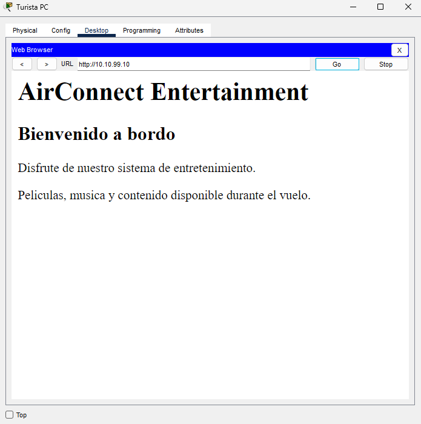

---

### Conclusión

La red quedó dividida correctamente en tres VLANs con distintos niveles de acceso.

La clase Turista puede acceder al servidor local pero no al ISP. La clase Business puede acceder al servidor y a la red externa, mientras que Administración tiene acceso a todos los segmentos.

Las pruebas realizadas dieron los resultados esperados.

---
