# Trabajo Práctico N° 5: Redes de Computadoras

**Integrantes:**
* Arias, Daniel Andrés
* Garzón, Pablo
* Gutierrez, Patricio
* Fernández y Fernández, Sergio Ezequiel
* Loza Denardi, Gabriel Jeremías
* Rocatagliatta, Leandro Agustin
* Zambellini, Matías Manuel

---

# Inciso 1

**a)** **`ICMP`** (`Internet Control Message Protocol`) o `Protocolo de Control de Mensajes de Internet`, es un protocolo de la capa de red, el cual funciona como un sistema de diagnóstico y notificación de errores de una red. Dado que el protocolo IP por sí mismo no tiene un mecanismo para confirmar si un paquete se entregó con éxito, `ICMP` proporciona un medio para verificar que los dispositivos de una red se comuniquen correctamente.
A diferencia de TCP y UDP, `ICMP` no transporta datos de aplicaciones. El payload de un mensaje `ICMP` contiene metadatos de control y diagnostico.

**b)** El protocolo `ICMP` viaja dentro de IP, encapsulado como su carga útil. El receptor lo identifica debido a que la cabecera del paquete IP tiene el campo **"Protocolo"** en el valor 1.

**c)** El comando `ping` verifica la conectividad y mide la latencia entre dispositivos enviando un mensaje de prueba llamado `Echo Request` (**Petición eco**) y esperando una confirmación del receptor llamada `Echo Reply` (**Respuesta eco**). Para distinguirlos, se utiliza el campo "`Tipo`", siendo este el valor `8` para el Request y `0` para el Reply. Ambos utilizan el "Código" en valor `0`. 

**d)** Un mensaje `ICMP` de tipo **Echo** contiene una cabecera mínima y obligatoria de exactamente 8 bytes, dividida en los siguientes cinco campos:

* **Tipo (8 bits):** Especifica el tipo de mensaje `ICMP`.
* **Código (8 bits):** Se usa para especificar parámetros del mensaje.
* **Checksum (16 bits):** Suma de comprobación para verificar la integridad del mensaje `ICMP` entero.
* **Identificador (2 bytes):** Un valor único que permite al emisor reconocer qué aplicación generó la solicitud.
* **Número de Secuencia (2 bytes):** Un contador que se incrementa en cada envío para poder emparejar exactamente cada respuesta con su pregunta original y calcular la latencia de ese paquete individual.

A continuación se muestra el paso a paso que se realizó para poder capturar paquetes `ICMP` mediante Wireshark y de donde se obtienen los datos para poder completar la tabla:

* **IPCONFIG:**

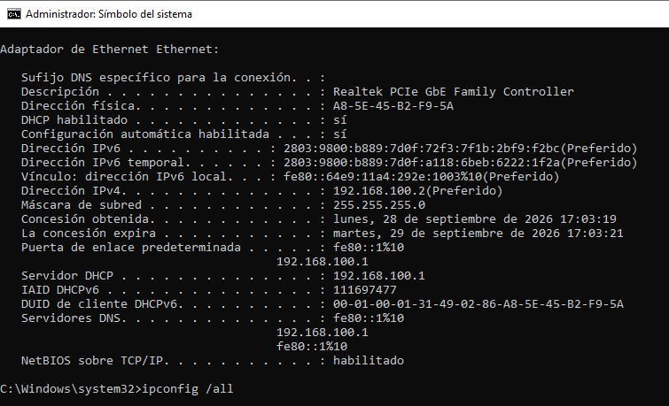

**PING:**

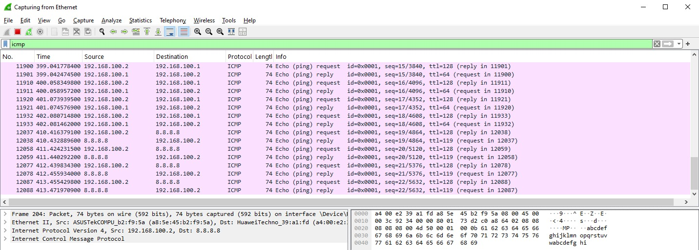

**REQUEST:**

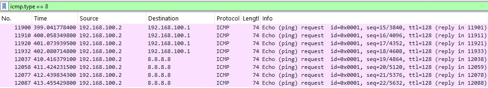

**REPLY:**

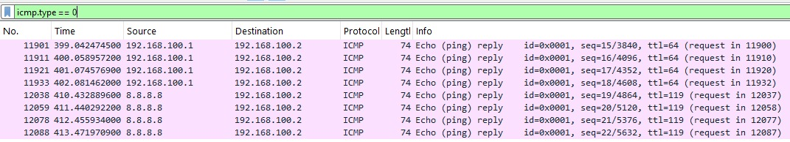

**GOOGLE:**

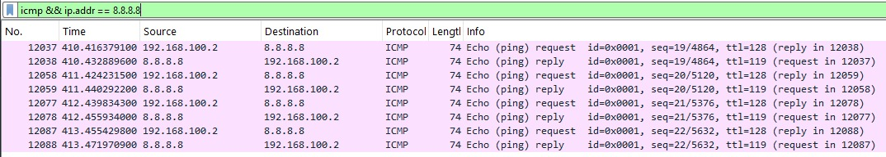

**ETHERNET_2:**

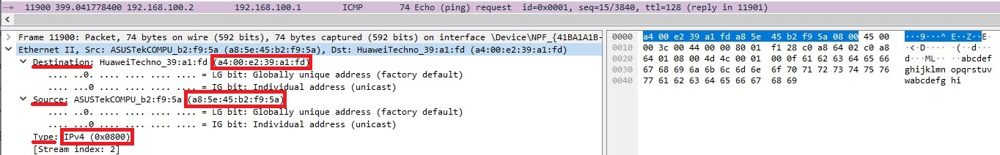

**IPv4:**

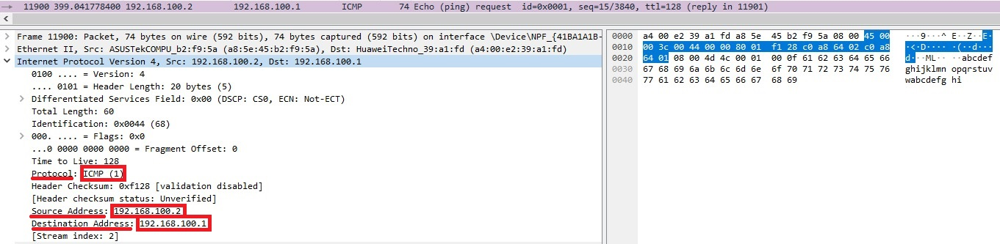

**PAYLOAD:**

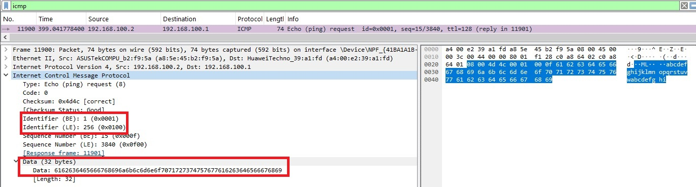

**TABLA FINAL:**

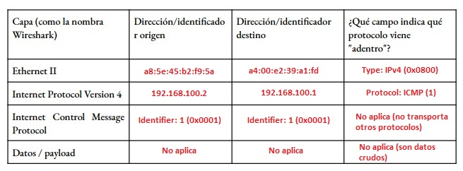

**a)** En la imagen se observa que la MAC de destino es la misma que la de nuestro gateway (imágenes anteriores), ya que el alcance de una dirección MAC es meramente local. Con la dirección MAC de un dispositivo solo se puede ir hasta el siguiente router, cambiando cada vez que realice un salto; en cambio con la IP que viaja encapsulada en la trama, si se mantendrá desde el origen hasta el final.

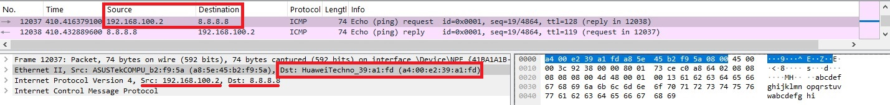

**b)** En Ethernet se observa que las direcciones MAC de origen y de destino se invierten, pero se mantiene el campo `Type`, ya que ambos siguen transportando un paquete `IPv4`. Para `IP` sucede lo mismo con las direcciones, estas están invertidas pero mantienen el mismo campo de protocolo. El campo `Type` de `ICMP` varía, siendo 8 para **Echo Request** y 0 para **Echo Reply**. El `Checksum` cambia, ya que se recalcula. Los `Identifier` (`BE`/`LE`) y `Sequence Number` (`BE`/`LE`) se mantienen iguales, debido a que estos se utilizan para que el dispositivo pueda emparejar la petición que envió con la respuesta.

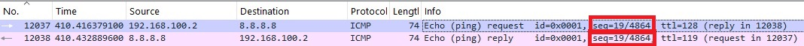

**c)** Como puede observarse en la imagen, el **payload** se encuentra en `ICMP` dentro de `Data`. En este caso, como fue enviado desde Windows, tiene 32 bytes y contiene datos arbitrarios; ya que solo se utilizan para verificar que llegue la misma información en el **reply**. La principal diferencia es que en Linux, el **payload** es de 56 bytes.

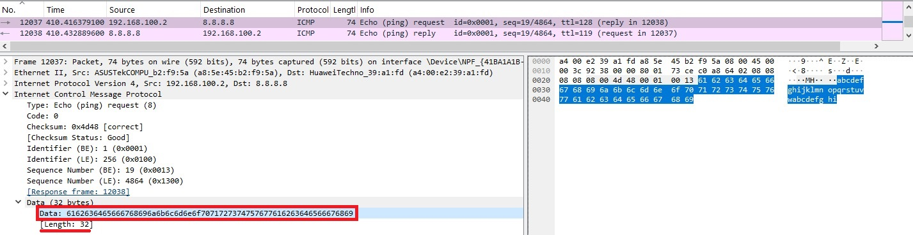

**d)** `TTL` (`Time to Live`) es un mecanismo en el cual cada paquete tiene un valor que al que se le desuenta 1 cada vez que hace un salto entre routers. Esto se hace por que si el paquete se encuentra en un bucle, en algún momento llegará a 0 y se destruirá. En nuestra captura, el valor es de `128` para el **request** y de `119` para el **reply**. El valor `TTL` de **reply** no es el original, ya que este valor que se recibe es la resta luego de haber pasado por todos los routers necesarios para llegar a la PC.

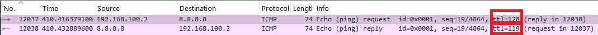

**e)** **Datos de Wireshark:**

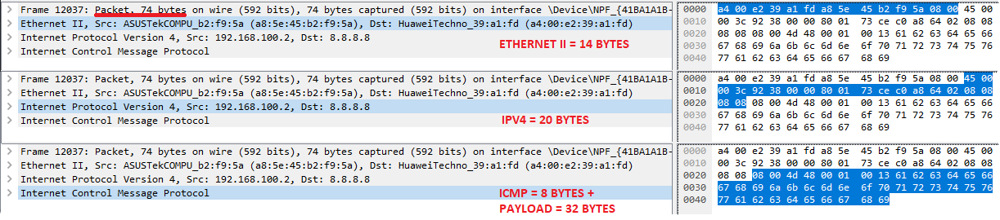 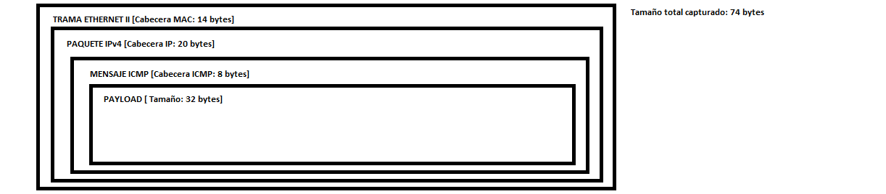

# Inciso 2
##  ARP: de una IP a una dirección MAC

**a)** `ARP` es una solución a la imposibilidad de usar el mapeo directo en direcciones físicas más largas que una dirreccion `IPv4`. Especialmente con direcciones Ethernet MAC, que es 16 bits mas larga que una direccion `IPv4`. Todo dentro de la misma red física. Es dicutible en qué capa ubicarla ya que su objetivo es mapear direciones IP que son de la capa 3, pero los mensajes no se encapsulan en esta capa, si no que viajan en el entramado ethernet, que corresponde a la capa 2.

**b)** **ARP Request y ARP Reply**

**ARP Request**: Es un paquete en el que se pregunta al host de una red que responda con la direccion hardware. Como aún no se conoce la direccion de ésta, en el mensaje, el campo de la direccion fisica se llena con 0's. Este paquete se enváa a todos los dispositivos conectados a la misma red física.

**ARP Reply**: Es un paquete que contiene tanto a la direccion `IPv4` como a la direccion física que se pidió originalmente. Este paquete es enviado al equipo que solicitó la direccion al principio.

**c)** **ARP Caché**

El **ARP Caché** es una memoria caché temporal donde se guardan las direccciones `IP-to-hardware` recientes con el objetivo de optimizar el proceso para transmisiones sucesivas, dado que, la transmisión constante de requests es caro y hace perder el tiempo. Esto es algo especificado por el estándar del software; es una obligación tenerlo.

**d)**

Primeramente, se busca en la memoria caché si recientemente se ha usado el `IP-to-hardware` asociada a la `IP` que se tiene en mi red local. En caso de no encontrarse en el caché, se lanza una `ARP Request` con la `IP` que se conoce y este devuelve un `ARP Reply` con su `MAC`. Luego, se guarda en el caché para un futuro uso.

**e)**

Sí, la MAC asociada al gateway coincide con la MAC destino que se vió anteriormente.

**f)** **Tabla con valores:**

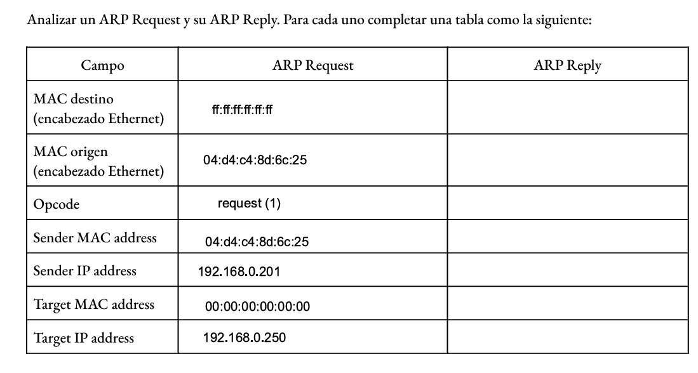

**a)**

El `Request` se enva a una dirección broadcast debido a que no conoce aún un dispositivo en la red que tiene esa IP; por lo que pregunta a toda la red LAN para encontrarlo. En cambio, el `Reply` es la respuesta del propietario de esta IP en la LAN que se envia a la MAC del equipo que hizo el Request. El `Target MAC address` en el request se encuentra relleno de ceros, porque no conoce la direccion MAC asociada a la IP que está preguntando.

**b)**

El valor que tiene el campo **Type** es `ARP(0x0806)`, y no tiene un encabezado IP. Como ARP no viaja dentro de la encapusalación IP, si no que viaja por la trama Ethernet, se puede decir que este "vive" en el límite entre la capa 2 y la capa 3.

**c)**

Al usar la opción **A**, aparecieron 4 paquetes `ARP Request` y no se obtuvo ninguna `Reply`. Al ser una IP inexistente, no existe ningún dispositivo con esa IP en la LAN; por lo que nadie va a responder al broadcast. Tampoco se puede observar un paquete `ICMP`, porque al no obtener la reply, el OS simplemente descarta los datos a enviar, ya que no es posible realizar un entramado Ethernet. 

**d)**

Si apareció nuevamente en el `ARP Request` ya que no se recibió una Reply al principio. Esto provocó que no se guarde en el caché y el sistema vuelve a mandar la Request. Por otro lado, la ventaja del uso de caché consiste en optimizar y acelerar el envío de paquetes, evitando así saturar la red con broadcast's frecuentes. Aunque, en caso de quedar una IP vieja, lo que podría ocurrir es que si se siguieran mandando paquetes a esa IP antigua, el caché sigue guardando hasta que expire.

# Inciso 4
##  Servidor TCP mínimo

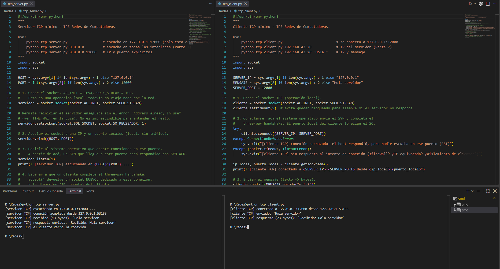

